# Time Pet Ledger 二级界面 Web 审查

审查日期：2026-10-06。范围：现有二级菜单、子页面、弹层与返回路径。交付为问题整理，没有实现重做。

结论：主页面已有一致的纸色阅读风格，但子弹层和复盘仍继承旧深色主题。优先修复核心文字可读性、无响应入口、表单校验、返回上下文、窄屏日期与辅助功能内容，再整理全部二级界面样式。

[详细问题与逐步表格](TABLES.md) · [逐步截图画廊](index.html) · [完整结构化证据](audit-data.json) · [详情辅助树](fact-detail-ax.txt) · [目标历史辅助树](goal-history-ax.txt) · [浏览器日志](browser-console.json)

## 覆盖与保留的优点

- 纸色页面、衬线大标题、细分隔线与陶土色主操作已经形成基础风格。
- 活动问答的节奏→标题→时间顺序清楚；空标题和空睡眠校验都留在原页。
- Unknown 与 Gap 仍按已交代事实和未处理空段区分；Gap 预填准确进入所选区间。
- 活动删除页给出具体区间，睡眠详情保留完整跨日事实；这些信息应在重做中保留。

## 已观察问题

P1：核心操作受阻、关键内容不可读取或窄屏/辅助技术无法正常访问。P2：一致性、阅读层级、上下文或反馈存在明显缺口。优先级是本次审查判断，不代表已有任务被授权实现。

### UI-01 · P1 · 弹层与主页面主题断开，核心文字不可读

首页和编辑主页面是纸色、墨色、陶土色；更多、目标选择、时间编辑和附加信息弹层却是深蓝与青色。一些标题、时间与错误字仍使用深墨/深红色，融入背景。

证据：[步骤 003](screenshots/03-more-menu.jpg)、[步骤 019](screenshots/19-goal-create.jpg)、[步骤 024](screenshots/24-goal-heatmap-settings.jpg)、[步骤 035](screenshots/35-activity-goal-sheet.jpg)、[步骤 044](screenshots/44-activity-details-sheet.jpg)、[步骤 046](screenshots/46-activity-time-sheet.jpg)、[步骤 053](screenshots/53-activity-time-validation.jpg)、[步骤 070](screenshots/70-sleep-time-sheet.jpg)、[步骤 076](screenshots/76-sleep-empty-time-sheet.jpg)。

建议：统一页面、Navigator 弹层和日期/时间控件的有效主题，先修复正文、字段值和错误提示的对比，再统一按钮、圆角与间距。不要只替换弹层背景色。

代码定位：[lib/app/main_app.dart:77](/home/tokiya/Projects/21-TimePetLedger/lib/app/main_app.dart:77)、[lib/app/theme/time_ledger_theme.dart:8](/home/tokiya/Projects/21-TimePetLedger/lib/app/theme/time_ledger_theme.dart:8)、[lib/features/ledger/presentation/activity/activity_recording_page.dart:209](/home/tokiya/Projects/21-TimePetLedger/lib/features/ledger/presentation/activity/activity_recording_page.dart:209)、[lib/features/ledger/presentation/activity/activity_sheets.dart:18](/home/tokiya/Projects/21-TimePetLedger/lib/features/ledger/presentation/activity/activity_sheets.dart:18)、[lib/features/ledger/presentation/activity/activity_time_sheet.dart:25](/home/tokiya/Projects/21-TimePetLedger/lib/features/ledger/presentation/activity/activity_time_sheet.dart:25)。

### UI-02 · P1 · 时间分布说明入口无响应

在历史账本打开更多，再点击“时间分布说明”，菜单关闭，说明界面没有出现。

证据：[步骤 093](screenshots/93-history-more.jpg)、[步骤 094](screenshots/94-time-distribution-explanation.jpg)。

建议：让菜单关闭后的说明动作能正常执行，并为说明打开、取消和返回补充导航验证。

代码定位：[lib/app/main_app.dart:387](/home/tokiya/Projects/21-TimePetLedger/lib/app/main_app.dart:387)、[lib/features/ledger/presentation/home/home_shell.dart:95](/home/tokiya/Projects/21-TimePetLedger/lib/features/ledger/presentation/home/home_shell.dart:95)。

### UI-03 · P1 · 新建目标校验把用户赶出表单

新建目标不填名称点击保存，弹窗先关闭，错误“先给目标起个名字”出现在列表。用户必须重新打开表单；列表切换后错误仍在。

证据：[步骤 019](screenshots/19-goal-create.jpg)、[步骤 020](screenshots/20-goal-create-validation.jpg)、[步骤 021](screenshots/21-goal-current-return.jpg)。

建议：在原表单完成名称校验，错误邻近字段显示并保留输入、焦点和重试入口；参考活动标题空值校验的留页行为。

代码定位：[lib/features/goals/presentation/goal_management_page.dart:783](/home/tokiya/Projects/21-TimePetLedger/lib/features/goals/presentation/goal_management_page.dart:783)。

### UI-04 · P1 · 记录编辑返回丢失详情阅读上下文

活动和睡眠均从详情进入编辑；点击返回后直接回到账本，无法继续阅读原详情。

证据：[步骤 059](screenshots/59-fact-detail-activity.jpg)、[步骤 062](screenshots/62-fact-edit-start.jpg)、[步骤 063](screenshots/63-fact-edit-return-location.jpg)、[步骤 064](screenshots/64-fact-detail-sleep.jpg)、[步骤 065](screenshots/65-sleep-edit.jpg)、[步骤 072](screenshots/72-sleep-edit-return-location.jpg)。

建议：保留来源详情的导航上下文，取消或保留草稿后返回原详情；保存后的返回策略需在重做时明确，不擅自改变领域事实。

代码定位：[lib/features/ledger/presentation/home/home_timeline_tab.dart:224](/home/tokiya/Projects/21-TimePetLedger/lib/features/ledger/presentation/home/home_timeline_tab.dart:224)、[lib/app/main_app.dart:506](/home/tokiya/Projects/21-TimePetLedger/lib/app/main_app.dart:506)。

### UI-05 · P2 · 目标此前记录没有后续操作

目标详情中的“设计首页”记录行点击后没有变化；行是普通容器，没有按钮语义。当前只能在这里阅读列表，不能继续查看完整记录。

证据：[步骤 126](screenshots/126-goal-history-bottom.jpg)、[步骤 127](screenshots/127-goal-history-tap-no-navigation.jpg)。

建议：重做时明确它是只读摘要还是详情入口；若作为入口，增加交互、语义和返回时保持图表/滚动位置。该项是体验缺口，不把尚未批准的导航功能当成既定领域要求。

代码定位：[lib/features/goals/presentation/goal_management_page.dart:695](/home/tokiya/Projects/21-TimePetLedger/lib/features/goals/presentation/goal_management_page.dart:695)。

### UI-06 · P1 · 账本日期在窄屏无法同时看到完整一周

390px 下右侧日期需要横向滚动；320px 下首屏仅可见周一至周五。控件有“左右滑动查看整周”说明，属于现有布局策略，日历扫描仍受阻。

证据：[步骤 082](screenshots/82-ledger-date-calendar.jpg)、[步骤 117](screenshots/117-ledger-calendar-320.jpg)。

建议：重新分配弹窗边距或使用更宽的日期容器，让七列在目标窄屏可见，并实际验证日期触控面积、月份切换与选中态。

### UI-07 · P1 · 记录详情缺少完整辅助功能内容

桌面截图中可见“设计首页”、08:00–10:00、毕业设计、推进及接续点；本次浏览器辅助树仅有区间标签和 disabled 字段名，没有完整值。移动端其他事实详情也出现同类缺口。

证据：[步骤 059](screenshots/59-fact-detail-activity.jpg)、[步骤 064](screenshots/64-fact-detail-sleep.jpg)、[步骤 086](screenshots/86-fact-detail-unknown.jpg)、[步骤 131](screenshots/131-fact-detail-accessibility.jpg)。

建议：为标题、开始/结束、时长和解释字段提供可读取的完整语义；只读字段应按阅读内容组织。再用真实读屏器与键盘验证，不能以截图宣布无障碍通过。

代码定位：[lib/features/ledger/presentation/fact_detail_page.dart:126](/home/tokiya/Projects/21-TimePetLedger/lib/features/ledger/presentation/fact_detail_page.dart:126)。

### UI-08 · P2 · 删除、归档和清空确认的形态与文案不一致

活动删除为纸色整页并展示区间；睡眠删除为深色通用弹窗且没有具体区间；复盘、清空采用普通青色确认。目标“删除”确认文案说明已引用目标会执行归档，入口仍易误解。

证据：[步骤 010](screenshots/10-settings-clear-confirm.jpg)、[步骤 028](screenshots/28-goal-delete-archive-confirm.jpg)、[步骤 030](screenshots/30-goal-archive-confirm.jpg)、[步骤 060](screenshots/60-fact-delete-confirm.jpg)、[步骤 067](screenshots/67-sleep-delete-confirm.jpg)、[步骤 111](screenshots/111-review-delete-confirm.jpg)。

建议：采用统一的确认层级、危险操作表现、对象名称/日期/区间与操作结果。保持已引用目标保留事实、转为归档的领域规则。

### UI-09 · P2 · 设置页重复标题，信息层级需要重排

导航栏与正文重复同一大标题，少量设置项被多层标题和大量空白分割；关于页也出现多个相近标题。

证据：[步骤 004](screenshots/04-settings-home.jpg)、[步骤 005](screenshots/05-settings-interface.jpg)、[步骤 007](screenshots/07-settings-record-reminder.jpg)、[步骤 009](screenshots/09-settings-advanced.jpg)、[步骤 013](screenshots/13-settings-about.jpg)。

建议：保留一个明确页面标题，用小分组标题组织选项、说明和状态。沿用当前阅读风格，减少重复层级。

### UI-10 · P2 · 设置与选择控件的当前状态不清楚

界面设置和记录方式的两个圆环在当前数据状态下都未勾选，用户无法从截图判断当前值。睡眠类型在辅助树中是普通按钮，未表达 selected 状态。

证据：[步骤 005](screenshots/05-settings-interface.jpg)、[步骤 007](screenshots/07-settings-record-reminder.jpg)、[步骤 073](screenshots/73-sleep-new-empty.jpg)、[步骤 075](screenshots/75-sleep-nap-selected.jpg)。

建议：明确展示当前值；如果没有用户选择，用可理解的未设置状态说明，不擅自决定未决默认值。选择状态同时暴露给辅助技术。

代码定位：[lib/features/settings/presentation/settings_page.dart:398](/home/tokiya/Projects/21-TimePetLedger/lib/features/settings/presentation/settings_page.dart:398)。

### UI-11 · P2 · 复盘仍是一组旧样式页面

复盘概览混合旧控件，编辑页整体是深色与青色。事实解释与额外字段密集，目标和日期选择又采用不同的控件形态。

证据：[步骤 098](screenshots/98-review-overview.jpg)、[步骤 099](screenshots/99-review-editor.jpg)、[步骤 100](screenshots/100-review-facts-expanded.jpg)、[步骤 101](screenshots/101-review-extra-fields.jpg)、[步骤 103](screenshots/103-review-goal-dialog.jpg)、[步骤 105](screenshots/105-review-date-dialog.jpg)。

建议：以事实概览、解释、明日第一步组织主次，统一页面与子弹层风格；保留 continuationHint 与 TomorrowFirstStep 的职责区别。Q-027 已说明复盘尚未做细，此处记录剩余设计范围。

### UI-12 · P2 · 日期与时间控件的语言、输入形态不统一

活动日期控件显示英文月份、星期；时间拨盘的辅助标签为英文；账本是中文自定义日历，复盘则只有文本日期框。返回按钮辅助名称为 Back。

证据：[步骤 047](screenshots/47-activity-date-picker.jpg)、[步骤 049](screenshots/49-activity-time-picker.jpg)、[步骤 082](screenshots/82-ledger-date-calendar.jpg)、[步骤 083](screenshots/83-ledger-date-text.jpg)、[步骤 105](screenshots/105-review-date-dialog.jpg)。

建议：统一中文本地化、日期格式和可切换输入方式；复用同一日期/时间交互规范，并保留端点独立精度和合法 Approximate 行为。

### UI-13 · P2 · 热力图和柱状图缺少足够的读数帮助

柱状图只有少量刻度，热力图虽写“深浅表示时长”却没有色阶对应的时长；过去无投入与未来空白外观不同，没有说明。

证据：[步骤 022](screenshots/22-goal-detail-bars.jpg)、[步骤 023](screenshots/23-goal-detail-heatmap.jpg)、[步骤 125](screenshots/125-goal-month-heatmap.jpg)。

建议：补足时长标尺、色阶范围、所选日读数及未来空白解释；只描述事实，不加入效率评分或自动评价。Q-033 的自然周/月及当前日截断口径保持不变。

### UI-14 · P2 · 演示目标创建日期显示 1970 年

演示目标“毕业设计”创建日期为 1970 年 1 月 1 日，破坏时间账本的可信度。原因是测试数据的 createdAt 使用 now: 1，不是本次观察到的真实数据迁移问题。

证据：[步骤 022](screenshots/22-goal-detail-bars.jpg)、[步骤 023](screenshots/23-goal-detail-heatmap.jpg)、[步骤 122](screenshots/122-goal-bars-reopen.jpg)、[步骤 125](screenshots/125-goal-month-heatmap.jpg)。

建议：后续在演示数据生成范围内用一致的参考日期创建夹具，避免把夹具问题归为生产事实计算错误。

代码定位：[lib/dev/seed_demo_data.dart:36](/home/tokiya/Projects/21-TimePetLedger/lib/dev/seed_demo_data.dart:36)。

### UI-15 · P2 · 关于页版本没有接入

版本显示“—”。SettingsPage 支持 versionLabel，但当前装配没有提供。

证据：[步骤 013](screenshots/13-settings-about.jpg)。

建议：在既有版本信息来源与装配范围内显示应用版本，避免为一个标签顺带安装依赖。

代码定位：[lib/features/settings/presentation/settings_page.dart:354](/home/tokiya/Projects/21-TimePetLedger/lib/features/settings/presentation/settings_page.dart:354)、[lib/app/bootstrap/app_bootstrap.dart:279](/home/tokiya/Projects/21-TimePetLedger/lib/app/bootstrap/app_bootstrap.dart:279)。

### UI-16 · P2 · 桌面二级页面缺少宽度约束

桌面目标月热力格过大，列表与新建按钮横跨屏幕；详情字段左右分散，阅读距离增大。

证据：[步骤 128](screenshots/128-goal-detail-desktop.jpg)、[步骤 129](screenshots/129-goals-list-desktop.jpg)、[步骤 131](screenshots/131-fact-detail-accessibility.jpg)。

建议：给正文、图表和表单设置合理最大宽度及对齐，保持移动端流式布局；分别验证 320、390 与桌面视口。

### UI-17 · P2 · 复盘放弃草稿没有与其他编辑器一致的确认

活动和睡眠放弃草稿会确认；复盘选择“放弃此复盘草稿”后直接清除并返回。本次清除的是审查新产生的编辑草稿，已提交复盘没有删除。

证据：[步骤 056](screenshots/56-activity-discard-confirm.jpg)、[步骤 079](screenshots/79-sleep-discard-confirm.jpg)、[步骤 113](screenshots/113-review-more-discard.jpg)、[步骤 114](screenshots/114-review-discard-direct-return.jpg)。

建议：明确放弃草稿的统一策略及可恢复性；在当前没有撤销入口的情况下，应让用户能在清除前理解结果并取消。

代码定位：[lib/features/review/presentation/review_form.dart:288](/home/tokiya/Projects/21-TimePetLedger/lib/features/review/presentation/review_form.dart:288)。

## 尚待验证的代码风险

- **设置偏好的实际消费路径还需运行验证**：目标页的 heatRange 初值为 week，_load 只读取 commonGoalId；目标页范围切换只修改局部状态。活动入口仍固定装配问答页，当前发现的代码路径未见记录方式偏好消费。本次未修改全局设置，不能把这一项算作已经用浏览器复现的失效。后续应验证设置→离开→重开→实际编辑/图表的行为。 位置：[lib/features/goals/presentation/goal_management_page.dart:51](/home/tokiya/Projects/21-TimePetLedger/lib/features/goals/presentation/goal_management_page.dart:51)、[lib/features/goals/presentation/goal_management_page.dart:75](/home/tokiya/Projects/21-TimePetLedger/lib/features/goals/presentation/goal_management_page.dart:75)、[lib/features/goals/presentation/goal_management_page.dart:759](/home/tokiya/Projects/21-TimePetLedger/lib/features/goals/presentation/goal_management_page.dart:759)、[lib/features/ledger/presentation/activity/activity_recording_entry.dart:16](/home/tokiya/Projects/21-TimePetLedger/lib/features/ledger/presentation/activity/activity_recording_entry.dart:16)。

- **菜单 busy 状态与说明调用的冲突**：_more 设置 opening=true 后调用 showDistribution；HomeShell.showDistribution 在 widget.busy 为 true 时直接返回。与步骤 94 无响应相符。刷新入口也调用带同类 guard 的 refreshFromMenu，但本次没有单独证明刷新失效，不列为已复现问题。 位置：[lib/app/main_app.dart:387](/home/tokiya/Projects/21-TimePetLedger/lib/app/main_app.dart:387)、[lib/features/ledger/presentation/home/home_shell.dart:83](/home/tokiya/Projects/21-TimePetLedger/lib/features/ledger/presentation/home/home_shell.dart:83)。

## 建议重做顺序

1. 统一有效主题与核心弹层：更多菜单、目标选择、目标表单、时间编辑、附加信息。
2. 修复操作闭环：说明入口、表单留页校验、详情编辑返回、放弃草稿策略。
3. 重排设置、目标详情与复盘的信息层级；统一确认、日期、选择控件。
4. 完成窄屏与桌面布局、语义、读屏器和键盘验证。

这只是后续实施建议；没有自动开始 UI Task 或修改领域合同。

## 方法与限制

- 本次审查使用当前工作区新构建的 Flutter Web、Codex 内置浏览器与本地 http://127.0.0.1:8766；界面语言中文，系统时区 Asia/Shanghai，日期 2026-10-06。该 origin 初次打开时由现有启动逻辑自动生成演示数据。
- 实际覆盖 390×844、320×740 与默认桌面 1176×1208 视口。132 个编号检查状态，130 张保留截图；25、119 是过渡帧，另存 rejected 并剔除。115 的标签指示动画不用于样式结论。
- 没有修改应用源代码、全局偏好或已提交的活动/睡眠/目标/复盘。删除、归档、清空未确认执行。问答操作和返回产生了本地审查草稿；复盘放弃动作直接移除了本次产生的草稿。热力图本月切换仅为当前目标页内状态。
- 没有验证真实保存后的持久化、删除后的恢复、跨进程重开、存储故障、权限失败或真实 Android/iOS 键盘。归档目标列表为空，恢复和未引用目标删除没有现成数据可测；首睡眠提醒在当前含睡眠夹具下没有覆盖。
- 浏览器捕获的 warn/error 日志为空，不代表功能正确；截图和浏览器辅助树也不能替代完整对比度测量、读屏器、键盘遍历、放大字体与平台无障碍测试。
- Q-029 提醒详细行为、Q-031 旧 Exact 展示、Q-032 睡眠预填等产品未决内容没有由本审查自行作答。Q-025、Q-026、Q-027、Q-030、Q-033、Q-034 的已定范围用于建议边界。

实际验证：`flutter build web --no-pub` 构建成功；`git diff --check` 通过；使用 Web 逐步操作并保存截图。没有运行 Dart 静态分析或测试，本次为只读 UI 审查且未改 Dart。构建的 Cupertino 字体/wasm dry-run 提示不是浏览器行为通过的证据。

## 全部步骤与截图

截图按实际操作顺序编号，返回、取消、校验及无响应状态也保留。每一张均在本次运行捕获并查看；图像未经过美化或重绘。

| 步骤 | 操作与截图 | 状态 | 观察 | 问题 |
| --- | --- | --- | --- | --- |
| 001 | [首页桌面基线](screenshots/01-home-desktop.jpg) | 本步骤可达 | 确认当前 Web 构建可运行，记录现有纸色、衬线标题与陶土色基线。 | — |
| 002 | [首页 390px](screenshots/02-home-mobile.jpg) | 本步骤可达 | 切换到 390×844；移动端作为二级界面的主要比较基线。 | — |
| 003 | [打开更多菜单](screenshots/03-more-menu.jpg) | 需修复/调整 | 菜单仍为旧深色与青色，和首页风格断开。 | UI-01 |
| 004 | [进入设置首页](screenshots/04-settings-home.jpg) | 需修复/调整 | 设置分组可理解；导航栏与正文重复“设置”。 | UI-09 |
| 005 | [打开界面设置](screenshots/05-settings-interface.jpg) | 需修复/调整 | 两个单选圆环均未显示选中；页面标题重复，当前范围不明确。 | UI-09, UI-10 |
| 006 | [返回设置](screenshots/06-settings-return.jpg) | 本步骤可达 | 返回层级正常，本次未修改偏好。 | — |
| 007 | [打开记录与提醒](screenshots/07-settings-record-reminder.jpg) | 需修复/调整 | 两个记录方式均未显示选中；提醒开启状态可见，提醒逻辑尚有产品未决项。 | UI-09, UI-10 |
| 008 | [返回设置](screenshots/08-settings-return.jpg) | 本步骤可达 | 返回层级正常，未切换记录方式或提醒。 | — |
| 009 | [打开高级选项](screenshots/09-settings-advanced.jpg) | 需修复/调整 | 事实数量与清空入口可读；界面标题重复。 | UI-09 |
| 010 | [打开清空确认](screenshots/10-settings-clear-confirm.jpg) | 需修复/调整 | 确认内容说明范围，但使用旧深色、青色主按钮，破坏性操作层级弱。 | UI-08 |
| 011 | [取消清空](screenshots/11-clear-cancelled.jpg) | 本步骤可达 | 取消后回到高级选项，未执行清空。 | — |
| 012 | [返回设置](screenshots/12-settings-return.jpg) | 本步骤可达 | 设置分组仍可访问。 | — |
| 013 | [打开关于](screenshots/13-settings-about.jpg) | 需修复/调整 | 版本为“—”；导航、正文和产品标题层级显得重复。 | UI-09, UI-15 |
| 014 | [关于返回](screenshots/14-about-return.jpg) | 本步骤可达 | 正常回到设置。 | — |
| 015 | [设置返回首页](screenshots/15-home-return.jpg) | 本步骤可达 | 正常返回首页。 | — |
| 016 | [更多→目标管理](screenshots/16-more-goals-entry.jpg) | 需调整 | 再次记录更多菜单的旧样式。 | — |
| 017 | [当前目标列表](screenshots/17-goals-list.jpg) | 本步骤可达 | 目标名称突出，底部新建入口明确；与弹层样式不一致。 | — |
| 018 | [切换已归档](screenshots/18-goals-archived-empty.jpg) | 部分覆盖 | 空状态可见；没有归档目标，恢复操作无法在现有夹具中检查。 | — |
| 019 | [打开新建目标](screenshots/19-goal-create.jpg) | 需修复/调整 | 弹窗是旧深色，输入区域和主页面风格不一致。 | UI-01, UI-03 |
| 020 | [空名称点击保存](screenshots/20-goal-create-validation.jpg) | 需修复/调整 | 弹窗直接关闭，错误落在目标列表，失去原输入上下文。 | UI-03 |
| 021 | [切回当前目标](screenshots/21-goal-current-return.jpg) | 需修复/调整 | 新建错误仍留在列表；应在表单内处理错误和重试。 | UI-03 |
| 022 | [打开目标柱状图](screenshots/22-goal-detail-bars.jpg) | 需修复/调整 | 当前目标与时长可读；创建日期显示 1970 年，图表需要更完整时长标尺。 | UI-13, UI-14 |
| 023 | [切换热力图](screenshots/23-goal-detail-heatmap.jpg) | 需修复/调整 | 周分布可见；颜色与时长映射不够明确。 | UI-13, UI-14 |
| 024 | [打开热力图设置](screenshots/24-goal-heatmap-settings.jpg) | 需修复/调整 | 深色弹层配深色标题，标题难读；本周、本月状态表达弱。 | UI-01 |
| 025 | 取消热力图设置（剔除过渡帧） | 过渡帧剔除 | 捕获到关闭动画，未作为视觉缺陷证据；后续稳定目标页可见于 26、27。 | — |
| 026 | [打开目标改名](screenshots/26-goal-rename.jpg) | 需调整 | 改名弹窗沿用旧深色；本次没有保存改名。 | — |
| 027 | [取消改名](screenshots/27-goal-rename-cancelled.jpg) | 本步骤可达 | 返回目标详情，取消正常。 | — |
| 028 | [打开删除目标确认](screenshots/28-goal-delete-archive-confirm.jpg) | 需修复/调整 | 确认文案说明已引用目标会归档并保留记录；入口与操作效果需要更清楚表达，未执行该操作。 | UI-08 |
| 029 | [取消目标删除](screenshots/29-goal-delete-cancelled.jpg) | 本步骤可达 | 目标和引用记录保持可见，未执行删除。 | — |
| 030 | [打开归档确认](screenshots/30-goal-archive-confirm.jpg) | 需修复/调整 | 归档确认仍为旧深色样式。 | UI-08 |
| 031 | [取消归档](screenshots/31-goal-archive-cancelled.jpg) | 本步骤可达 | 目标仍处于当前目标列表。 | — |
| 032 | [目标详情返回列表](screenshots/32-goals-list-return.jpg) | 本步骤可达 | 列表与详情导航正常。 | — |
| 033 | [目标列表返回首页](screenshots/33-goals-home-return.jpg) | 本步骤可达 | 回到原账本日期。 | — |
| 034 | [打开记录一笔](screenshots/34-activity-rhythm.jpg) | 本步骤可达 | 问答引导留白与首页风格一致，节奏选择是可选解释。 | — |
| 035 | [打开目标选择](screenshots/35-activity-goal-sheet.jpg) | 需修复/调整 | 深色底与深色标题相撞，选择弹层可读性差。 | UI-01 |
| 036 | [取消目标选择](screenshots/36-activity-goal-cancelled.jpg) | 本步骤可达 | 正常返回节奏步骤。 | — |
| 037 | [选择卡住](screenshots/37-activity-stuck-options.jpg) | 本步骤可达 | 原因入口出现；选项保持解释性质，没有变成事实类型。 | — |
| 038 | [返回节奏选择](screenshots/38-activity-rhythm-return.jpg) | 本步骤可达 | 切回首步检查状态。 | — |
| 039 | [选择恢复](screenshots/39-activity-recovery-options.jpg) | 本步骤可达 | 恢复方式与感受入口可见，样式仍跟随主页面。 | — |
| 040 | [进入活动标题](screenshots/40-activity-title.jpg) | 本步骤可达 | 标题输入页保持纸色风格，下一步可见。 | — |
| 041 | [空标题尝试继续](screenshots/41-activity-title-validation.jpg) | 本步骤可达 | 错误留在当前步骤，能继续修正；这种行为应作为目标表单的参考。 | — |
| 042 | [选择想不起来](screenshots/42-activity-unknown.jpg) | 本步骤可达 | Unknown 独立入口可达，没有把尚未记录的 Gap 误当成 Unknown。 | — |
| 043 | [进入时间步骤](screenshots/43-activity-time-step.jpg) | 本步骤可达 | 时间区间和完成操作可见，展开编辑后主题切换突兀。 | — |
| 044 | [打开接续点与备注](screenshots/44-activity-details-sheet.jpg) | 需修复/调整 | 底部弹层标题几乎融入深色背景，输入样式与引导页不一致。 | UI-01 |
| 045 | [取消附加信息](screenshots/45-activity-details-cancelled.jpg) | 本步骤可达 | 正常返回时间步骤。 | — |
| 046 | [打开活动时间编辑](screenshots/46-activity-time-sheet.jpg) | 需修复/调整 | 开始、结束和时长在深色底上很难辨认，核心填写环节受影响。 | UI-01 |
| 047 | [打开活动日期选择](screenshots/47-activity-date-picker.jpg) | 需修复/调整 | 原生日期控件英文，与中文账本日期控件不一致。 | UI-12 |
| 048 | [取消活动日期](screenshots/48-activity-date-cancelled.jpg) | 本步骤可达 | 返回时间编辑，未应用日期变化。 | — |
| 049 | [打开时间拨盘](screenshots/49-activity-time-picker.jpg) | 需修复/调整 | 时钟拨盘与中文业务页风格不同，辅助标签仍为英文。 | UI-12 |
| 050 | [取消时间拨盘](screenshots/50-activity-picker-cancelled.jpg) | 本步骤可达 | 返回时间编辑。 | — |
| 051 | [切换手动时间输入](screenshots/51-activity-time-text.jpg) | 本步骤可达 | 手动输入年月日时分可达，错误处理需要与其他选择方式一致。 | — |
| 052 | [输入结束早于开始](screenshots/52-activity-time-invalid-input.jpg) | 本步骤可达 | 设置反向时间区间，用于检查校验。 | — |
| 053 | [提交反向区间](screenshots/53-activity-time-validation.jpg) | 需修复/调整 | 校验存在，但错误深红字在深色背景上难辨认。 | UI-01 |
| 054 | [取消错误时间编辑](screenshots/54-activity-invalid-cancelled.jpg) | 本步骤可达 | 退出当前无效编辑，未提交记录事实。 | — |
| 055 | [打开活动更多](screenshots/55-activity-more-menu.jpg) | 需调整 | 保留草稿、放弃草稿入口可见，但菜单仍是旧深色。 | — |
| 056 | [打开活动放弃确认](screenshots/56-activity-discard-confirm.jpg) | 需修复/调整 | 有确认步骤，明确说明将丢弃未保存内容。 | UI-17 |
| 057 | [取消活动放弃](screenshots/57-activity-discard-cancelled.jpg) | 本步骤可达 | 返回活动编辑，草稿仍保留。 | — |
| 058 | [活动返回首页](screenshots/58-activity-home-return.jpg) | 本步骤可达 | 返回首页会保留本次检查产生的草稿；未提交活动事实。 | — |
| 059 | [打开活动事实详情](screenshots/59-fact-detail-activity.jpg) | 需修复/调整 | 纸色详情清晰；标题、实际时间与字段值缺少完整的辅助功能语义。 | UI-04, UI-07 |
| 060 | [打开活动删除确认](screenshots/60-fact-delete-confirm.jpg) | 需修复/调整 | 整页确认包含具体区间，信息比其他删除弹窗完整。 | UI-08 |
| 061 | [取消活动删除](screenshots/61-fact-delete-cancelled.jpg) | 本步骤可达 | 正常返回原详情，未删除事实。 | — |
| 062 | [从详情进入完整编辑](screenshots/62-fact-edit-start.jpg) | 需修复/调整 | 进入问答编辑；原详情页已从返回栈退出。 | UI-04 |
| 063 | [编辑后返回](screenshots/63-fact-edit-return-location.jpg) | 需修复/调整 | 直接回到账本，不回到原详情页，阅读上下文中断。 | UI-04 |
| 064 | [打开睡眠详情](screenshots/64-fact-detail-sleep.jpg) | 需修复/调整 | 完整跨日事实与当前日交集都有展示；删除入口与活动不同。 | UI-04, UI-07 |
| 065 | [从睡眠详情进入编辑](screenshots/65-sleep-edit.jpg) | 需修复/调整 | 睡眠编辑保留纸色风格；删除隐藏于更多菜单。 | UI-04 |
| 066 | [打开睡眠编辑更多](screenshots/66-sleep-edit-menu.jpg) | 需调整 | 更多菜单仍为旧深色。 | — |
| 067 | [打开睡眠删除确认](screenshots/67-sleep-delete-confirm.jpg) | 需修复/调整 | 确认文案没有活动删除页那样的具体区间，且样式完全不同。 | UI-08 |
| 068 | [取消睡眠删除](screenshots/68-sleep-delete-cancelled.jpg) | 本步骤可达 | 返回睡眠编辑，没有删除事实。 | — |
| 069 | [展开睡眠备注](screenshots/69-sleep-note-expanded.jpg) | 本步骤可达 | 备注是内联展开，纸色样式正常。 | — |
| 070 | [打开睡眠时间编辑](screenshots/70-sleep-time-sheet.jpg) | 需修复/调整 | 时间编辑与活动复用同类深色弹层，可读性问题重复出现。 | UI-01 |
| 071 | [取消睡眠时间](screenshots/71-sleep-time-cancelled.jpg) | 本步骤可达 | 正常返回睡眠编辑。 | — |
| 072 | [睡眠编辑返回](screenshots/72-sleep-edit-return-location.jpg) | 需修复/调整 | 直接回到账本，没有返回睡眠详情。 | UI-04 |
| 073 | [打开新增睡眠](screenshots/73-sleep-new-empty.jpg) | 需修复/调整 | 空表单可见，主睡眠与小睡选择的状态语义需要补足。 | UI-10 |
| 074 | [空睡眠尝试保存](screenshots/74-sleep-new-validation.jpg) | 本步骤可达 | 错误留在当前页；未产生睡眠事实。 | — |
| 075 | [切换小睡](screenshots/75-sleep-nap-selected.jpg) | 需修复/调整 | 可切换类型；选择态应同时向辅助技术暴露。 | UI-10 |
| 076 | [打开空睡眠时间编辑](screenshots/76-sleep-empty-time-sheet.jpg) | 需修复/调整 | 深色弹层中未设置时间的提示对比度不足。 | UI-01 |
| 077 | [取消空睡眠时间](screenshots/77-sleep-empty-time-cancelled.jpg) | 本步骤可达 | 回到睡眠表单。 | — |
| 078 | [打开新增睡眠更多](screenshots/78-sleep-new-menu.jpg) | 本步骤可达 | 保留与放弃草稿入口可达。 | — |
| 079 | [打开睡眠放弃确认](screenshots/79-sleep-discard-confirm.jpg) | 需修复/调整 | 有明确确认步骤。 | UI-17 |
| 080 | [取消睡眠放弃](screenshots/80-sleep-discard-cancelled.jpg) | 本步骤可达 | 保留本次产生的睡眠草稿。 | — |
| 081 | [新增睡眠返回](screenshots/81-sleep-home-return.jpg) | 本步骤可达 | 返回账本，未提交睡眠事实。 | — |
| 082 | [打开账本日期（390px）](screenshots/82-ledger-date-calendar.jpg) | 需修复/调整 | 需横向滚动才能看到完整一周，右侧日期被裁出当前视野。 | UI-06, UI-12 |
| 083 | [切换手动账本日期](screenshots/83-ledger-date-text.jpg) | 需修复/调整 | 中文手动日期入口可达。 | UI-12 |
| 084 | [输入昨天日期](screenshots/84-ledger-date-yesterday-input.jpg) | 本步骤可达 | 选择 2026-10-05，检查有历史事实和复盘的状态。 | — |
| 085 | [显示历史时间线](screenshots/85-history-timeline.jpg) | 本步骤可达 | 日期切换成功；已记录事实与未处理空段清楚分开。 | — |
| 086 | [打开 Unknown 详情](screenshots/86-fact-detail-unknown.jpg) | 需修复/调整 | 已交代事实展示正确；实际区间等值在辅助树中缺失。 | UI-07 |
| 087 | [Unknown 返回](screenshots/87-unknown-home-return.jpg) | 本步骤可达 | 回到原历史日期。 | — |
| 088 | [点击 Gap 补记](screenshots/88-gap-recording-start.jpg) | 本步骤可达 | 补记入口直接进入记录引导，保留所选空段上下文。 | — |
| 089 | [Gap 补记标题步](screenshots/89-gap-title-step.jpg) | 本步骤可达 | 标题输入和 Unknown 选项可达。 | — |
| 090 | [Gap 选择想不起来](screenshots/90-gap-unknown-selected.jpg) | 本步骤可达 | 明确选择 Unknown 后继续，未自动把 Gap 持久化为事实。 | — |
| 091 | [Gap 时间预填](screenshots/91-gap-time-prefill.jpg) | 本步骤可达 | 时间范围对应所选空段；本次没有完成提交。 | — |
| 092 | [Gap 补记返回](screenshots/92-gap-home-return.jpg) | 本步骤可达 | 返回历史时间线，事实没有新增。 | — |
| 093 | [历史页打开更多](screenshots/93-history-more.jpg) | 需修复/调整 | 准备检查“时间分布说明”。 | UI-02 |
| 094 | [点击时间分布说明](screenshots/94-time-distribution-explanation.jpg) | 需修复/调整 | 菜单关闭后仍是账本，说明没有出现；入口可复现无响应。 | UI-02 |
| 095 | [切换摘要](screenshots/95-summary-current.jpg) | 本步骤可达 | 摘要可达，颜色和字号延续首页；与日期选择共享当前日期。 | — |
| 096 | [摘要进入记录睡眠](screenshots/96-summary-sleep-entry.jpg) | 本步骤可达 | 入口可达，仍进入相同睡眠编辑流程。 | — |
| 097 | [睡眠返回摘要](screenshots/97-summary-sleep-return.jpg) | 本步骤可达 | 回到摘要，标签上下文保留。 | — |
| 098 | [切换复盘概览](screenshots/98-review-overview.jpg) | 需修复/调整 | 旧式控件与纸色首页混合，重复日期控制和解释文字使层级拥挤。 | UI-11 |
| 099 | [打开复盘编辑](screenshots/99-review-editor.jpg) | 需修复/调整 | 整页恢复旧深色与青色，没有延续主界面风格。 | UI-11 |
| 100 | [展开复盘事实区](screenshots/100-review-facts-expanded.jpg) | 需修复/调整 | 活动、睡眠、空段解释密集，应保持事实口径并整理信息层级。 | UI-11 |
| 101 | [展开复盘额外字段](screenshots/101-review-extra-fields.jpg) | 需修复/调整 | 附加字段较多，主要解释与明日第一步的优先级需要重排。 | UI-11 |
| 102 | [检查明日第一步输入](screenshots/102-review-input-finish.jpg) | 本步骤可达 | 输入可达，没有保存对已提交复盘的修改。 | — |
| 103 | [打开复盘目标选择](screenshots/103-review-goal-dialog.jpg) | 需修复/调整 | 此处为旧式对话框，与活动目标选择弹层形态不同。 | UI-11 |
| 104 | [取消复盘目标](screenshots/104-review-goal-cancelled.jpg) | 本步骤可达 | 返回复盘编辑。 | — |
| 105 | [打开复盘日期输入](screenshots/105-review-date-dialog.jpg) | 需修复/调整 | 仅文本式日期编辑，与其他日期控件不一致。 | UI-11, UI-12 |
| 106 | [取消复盘日期](screenshots/106-review-date-cancelled.jpg) | 本步骤可达 | 原日期保留。 | — |
| 107 | [打开复盘更多](screenshots/107-review-more-menu.jpg) | 本步骤可达 | 保留草稿与放弃草稿可见。 | — |
| 108 | [复盘返回](screenshots/108-review-return.jpg) | 本步骤可达 | 返回复盘概览，保留本次编辑草稿。 | — |
| 109 | [重新进入复盘编辑](screenshots/109-review-reopen.jpg) | 本步骤可达 | 草稿可重新进入。 | — |
| 110 | [再次打开复盘更多](screenshots/110-review-more-menu.jpg) | 本步骤可达 | 准备检查删除确认。 | — |
| 111 | [打开删除复盘确认](screenshots/111-review-delete-confirm.jpg) | 需修复/调整 | 包含日期，但确认按钮仍为普通青色，与活动删除样式不同。 | UI-08 |
| 112 | [取消复盘删除](screenshots/112-review-delete-cancelled.jpg) | 本步骤可达 | 未删除已提交复盘。 | — |
| 113 | [选择放弃复盘草稿](screenshots/113-review-more-discard.jpg) | 需修复/调整 | 准备观察放弃行为。 | UI-17 |
| 114 | [放弃直接返回](screenshots/114-review-discard-direct-return.jpg) | 需修复/调整 | 没有二次确认；本次审查生成的复盘草稿被清除，已提交复盘保留。 | UI-17 |
| 115 | [切回历史时间线](screenshots/115-review-timeline-return.jpg) | 本步骤可达 | 时间线内容恢复；截图下方标签指示仍带切换动画，不用于样式结论。 | — |
| 116 | [首页 320px](screenshots/116-home-320.jpg) | 本步骤可达 | 切换到 320×740，复查窄屏。 | — |
| 117 | [账本日期 320px](screenshots/117-ledger-calendar-320.jpg) | 需修复/调整 | 只看到周一至周五，横向滚动条明显；不是随机渲染溢出，而是当前布局策略。 | UI-06 |
| 118 | [取消窄屏日期](screenshots/118-calendar-320-cancelled.jpg) | 本步骤可达 | 正常返回账本。 | — |
| 119 | 恢复 390px（剔除过渡帧） | 过渡帧剔除 | 捕获到视口调整过渡状态，未用于缺陷判定；后续 120 为稳定状态。 | — |
| 120 | [更多→目标复查](screenshots/120-more-final-goals.jpg) | 本步骤可达 | 390px 稳定画面，复查图表与此前记录。 | — |
| 121 | [重新打开目标列表](screenshots/121-goals-reopen.jpg) | 本步骤可达 | 目标数量未变化。 | — |
| 122 | [重新打开柱状图](screenshots/122-goal-bars-reopen.jpg) | 需修复/调整 | 图表时长可读，创建日期仍显示 1970 年。 | UI-14 |
| 123 | [重新打开热力图](screenshots/123-goal-heat-reopen.jpg) | 本步骤可达 | 检查周分布与设置入口。 | — |
| 124 | [打开热力图范围菜单](screenshots/124-goal-range-menu.jpg) | 需调整 | 旧深色弹层问题再次复现。 | — |
| 125 | [切换本月热力图](screenshots/125-goal-month-heatmap.jpg) | 需修复/调整 | 历史空白与未来空白样式不同，但没有说明；缺少时长色阶刻度。 | UI-13, UI-14 |
| 126 | [滚动到此前记录](screenshots/126-goal-history-bottom.jpg) | 需修复/调整 | 列表显示活动与时长，但行没有可操作指示。 | UI-05 |
| 127 | [点击此前记录](screenshots/127-goal-history-tap-no-navigation.jpg) | 需修复/调整 | 点击“设计首页”没有导航；辅助树也没有对应按钮语义。 | UI-05 |
| 128 | [目标详情桌面复查](screenshots/128-goal-detail-desktop.jpg) | 需修复/调整 | 默认桌面视口下月热力格与内容横向放大，缺少内容最大宽度。 | UI-16 |
| 129 | [目标列表桌面复查](screenshots/129-goals-list-desktop.jpg) | 需修复/调整 | 新建按钮横跨屏幕、内容过度分散，响应布局需与移动端分别处理。 | UI-16 |
| 130 | [桌面返回账本](screenshots/130-home-desktop-final.jpg) | 本步骤可达 | 未新增或删除已提交事实。 | — |
| 131 | [桌面详情辅助树复查](screenshots/131-fact-detail-accessibility.jpg) | 需修复/调整 | 可见标题、08:00–10:00、毕业设计、推进与接续点，但辅助树没有这些完整值。 | UI-07, UI-16 |
| 132 | [审查结束返回账本](screenshots/132-home-return-complete.jpg) | 本步骤可达 | 返回 10 月 5 日时间线；浏览器警告、错误日志为空，视觉与行为问题仍存在。 | — |

## 逐步图像

### 基线与入口

**001 · 首页桌面基线**

确认当前 Web 构建可运行，记录现有纸色、衬线标题与陶土色基线。

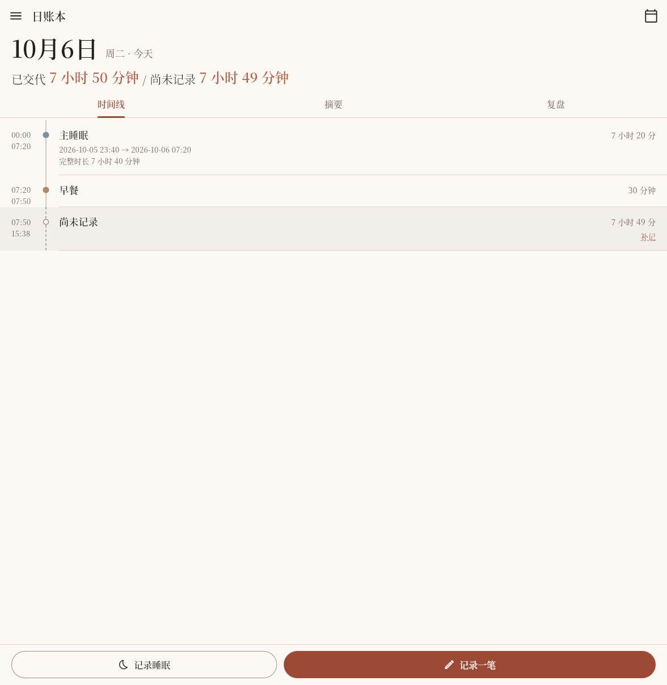

**002 · 首页 390px**

切换到 390×844；移动端作为二级界面的主要比较基线。

**003 · 打开更多菜单**

菜单仍为旧深色与青色，和首页风格断开。

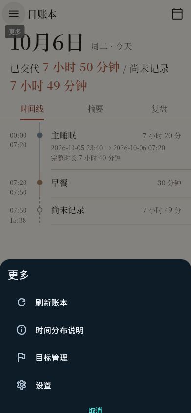

### 设置

**004 · 进入设置首页**

设置分组可理解；导航栏与正文重复“设置”。

**005 · 打开界面设置**

两个单选圆环均未显示选中；页面标题重复，当前范围不明确。

**006 · 返回设置**

返回层级正常，本次未修改偏好。

**007 · 打开记录与提醒**

两个记录方式均未显示选中；提醒开启状态可见，提醒逻辑尚有产品未决项。

**008 · 返回设置**

返回层级正常，未切换记录方式或提醒。

**009 · 打开高级选项**

事实数量与清空入口可读；界面标题重复。

**010 · 打开清空确认**

确认内容说明范围，但使用旧深色、青色主按钮，破坏性操作层级弱。

**011 · 取消清空**

取消后回到高级选项，未执行清空。

**012 · 返回设置**

设置分组仍可访问。

**013 · 打开关于**

版本为“—”；导航、正文和产品标题层级显得重复。

**014 · 关于返回**

正常回到设置。

**015 · 设置返回首页**

正常返回首页。

### 目标管理

**016 · 更多→目标管理**

再次记录更多菜单的旧样式。

**017 · 当前目标列表**

目标名称突出，底部新建入口明确；与弹层样式不一致。

**018 · 切换已归档**

空状态可见；没有归档目标，恢复操作无法在现有夹具中检查。

**019 · 打开新建目标**

弹窗是旧深色，输入区域和主页面风格不一致。

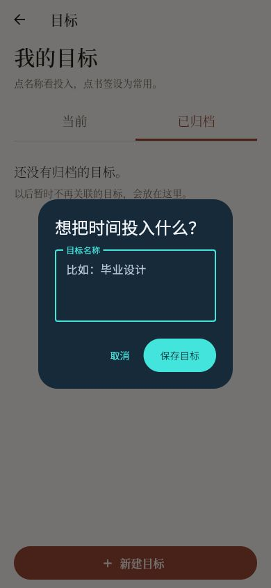

**020 · 空名称点击保存**

弹窗直接关闭，错误落在目标列表，失去原输入上下文。

**021 · 切回当前目标**

新建错误仍留在列表；应在表单内处理错误和重试。

**022 · 打开目标柱状图**

当前目标与时长可读；创建日期显示 1970 年，图表需要更完整时长标尺。

**023 · 切换热力图**

周分布可见；颜色与时长映射不够明确。

**024 · 打开热力图设置**

深色弹层配深色标题，标题难读；本周、本月状态表达弱。

**025 · 取消热力图设置（剔除过渡帧）**

捕获到关闭动画，未作为视觉缺陷证据；后续稳定目标页可见于 26、27。

**026 · 打开目标改名**

改名弹窗沿用旧深色；本次没有保存改名。

**027 · 取消改名**

返回目标详情，取消正常。

**028 · 打开删除目标确认**

确认文案说明已引用目标会归档并保留记录；入口与操作效果需要更清楚表达，未执行该操作。

**029 · 取消目标删除**

目标和引用记录保持可见，未执行删除。

**030 · 打开归档确认**

归档确认仍为旧深色样式。

**031 · 取消归档**

目标仍处于当前目标列表。

**032 · 目标详情返回列表**

列表与详情导航正常。

**033 · 目标列表返回首页**

回到原账本日期。

### 活动记录

**034 · 打开记录一笔**

问答引导留白与首页风格一致，节奏选择是可选解释。

**035 · 打开目标选择**

深色底与深色标题相撞，选择弹层可读性差。

**036 · 取消目标选择**

正常返回节奏步骤。

**037 · 选择卡住**

原因入口出现；选项保持解释性质，没有变成事实类型。

**038 · 返回节奏选择**

切回首步检查状态。

**039 · 选择恢复**

恢复方式与感受入口可见，样式仍跟随主页面。

**040 · 进入活动标题**

标题输入页保持纸色风格，下一步可见。

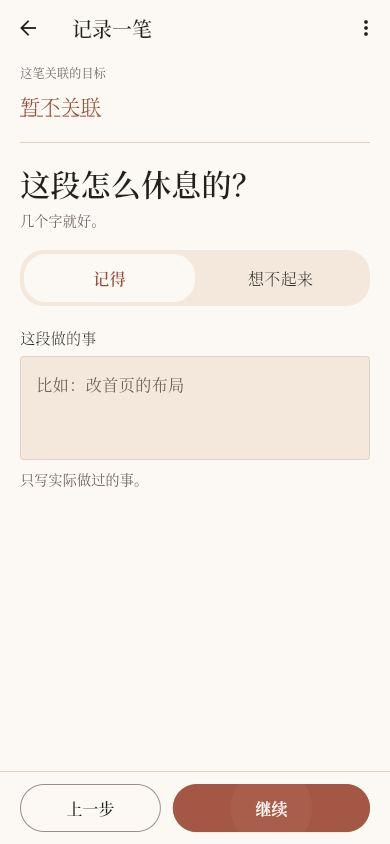

**041 · 空标题尝试继续**

错误留在当前步骤，能继续修正；这种行为应作为目标表单的参考。

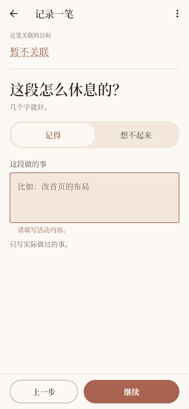

**042 · 选择想不起来**

Unknown 独立入口可达，没有把尚未记录的 Gap 误当成 Unknown。

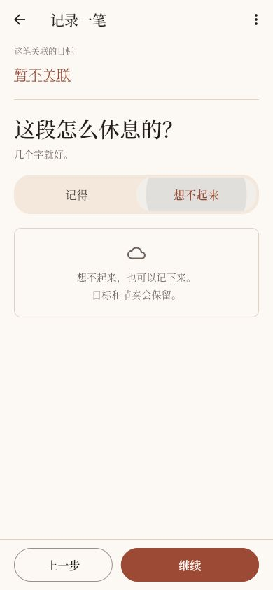

**043 · 进入时间步骤**

时间区间和完成操作可见，展开编辑后主题切换突兀。

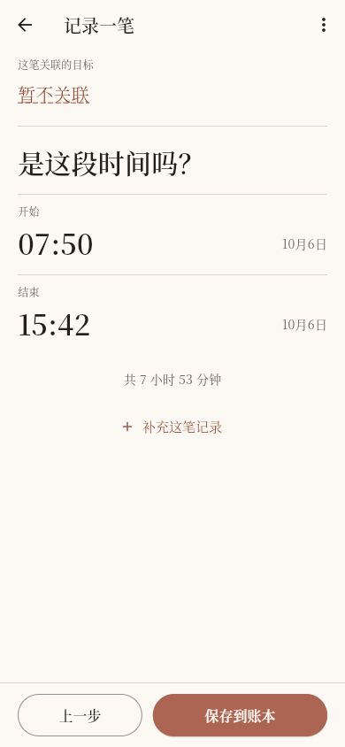

**044 · 打开接续点与备注**

底部弹层标题几乎融入深色背景，输入样式与引导页不一致。

**045 · 取消附加信息**

正常返回时间步骤。

**046 · 打开活动时间编辑**

开始、结束和时长在深色底上很难辨认，核心填写环节受影响。

**047 · 打开活动日期选择**

原生日期控件英文，与中文账本日期控件不一致。

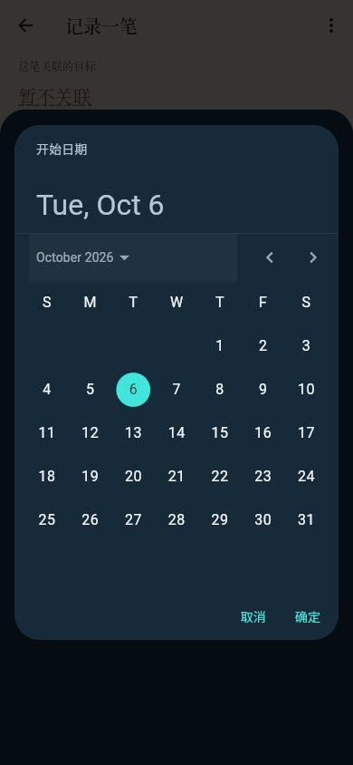

**048 · 取消活动日期**

返回时间编辑，未应用日期变化。

**049 · 打开时间拨盘**

时钟拨盘与中文业务页风格不同，辅助标签仍为英文。

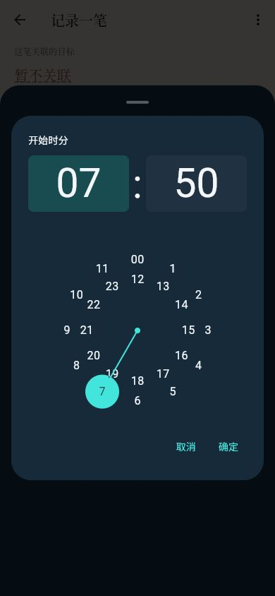

**050 · 取消时间拨盘**

返回时间编辑。

**051 · 切换手动时间输入**

手动输入年月日时分可达，错误处理需要与其他选择方式一致。

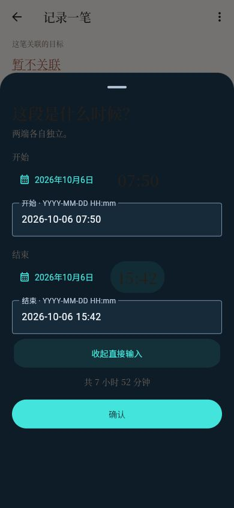

**052 · 输入结束早于开始**

设置反向时间区间，用于检查校验。

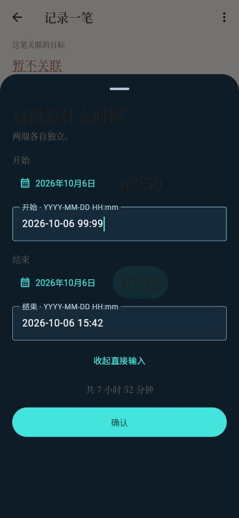

**053 · 提交反向区间**

校验存在，但错误深红字在深色背景上难辨认。

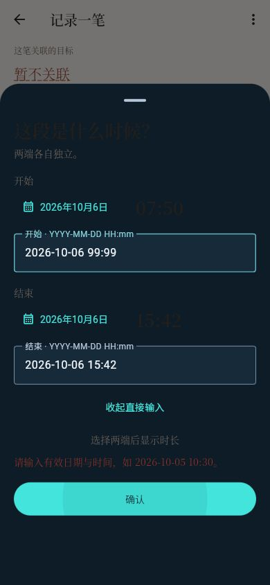

**054 · 取消错误时间编辑**

退出当前无效编辑，未提交记录事实。

**055 · 打开活动更多**

保留草稿、放弃草稿入口可见，但菜单仍是旧深色。

**056 · 打开活动放弃确认**

有确认步骤，明确说明将丢弃未保存内容。

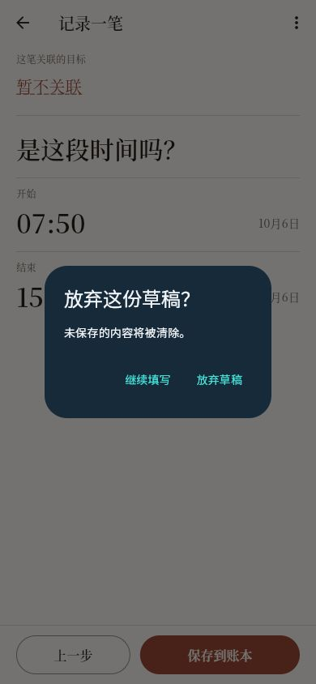

**057 · 取消活动放弃**

返回活动编辑，草稿仍保留。

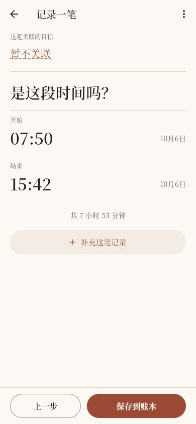

**058 · 活动返回首页**

返回首页会保留本次检查产生的草稿；未提交活动事实。

### 事实详情与编辑

**059 · 打开活动事实详情**

纸色详情清晰；标题、实际时间与字段值缺少完整的辅助功能语义。

**060 · 打开活动删除确认**

整页确认包含具体区间，信息比其他删除弹窗完整。

**061 · 取消活动删除**

正常返回原详情，未删除事实。

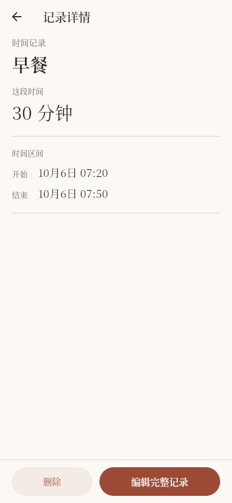

**062 · 从详情进入完整编辑**

进入问答编辑；原详情页已从返回栈退出。

**063 · 编辑后返回**

直接回到账本，不回到原详情页，阅读上下文中断。

**064 · 打开睡眠详情**

完整跨日事实与当前日交集都有展示；删除入口与活动不同。

**065 · 从睡眠详情进入编辑**

睡眠编辑保留纸色风格；删除隐藏于更多菜单。

**066 · 打开睡眠编辑更多**

更多菜单仍为旧深色。

**067 · 打开睡眠删除确认**

确认文案没有活动删除页那样的具体区间，且样式完全不同。

**068 · 取消睡眠删除**

返回睡眠编辑，没有删除事实。

**069 · 展开睡眠备注**

备注是内联展开，纸色样式正常。

**070 · 打开睡眠时间编辑**

时间编辑与活动复用同类深色弹层，可读性问题重复出现。

**071 · 取消睡眠时间**

正常返回睡眠编辑。

**072 · 睡眠编辑返回**

直接回到账本，没有返回睡眠详情。

### 新增睡眠

**073 · 打开新增睡眠**

空表单可见，主睡眠与小睡选择的状态语义需要补足。

**074 · 空睡眠尝试保存**

错误留在当前页；未产生睡眠事实。

**075 · 切换小睡**

可切换类型；选择态应同时向辅助技术暴露。

**076 · 打开空睡眠时间编辑**

深色弹层中未设置时间的提示对比度不足。

**077 · 取消空睡眠时间**

回到睡眠表单。

**078 · 打开新增睡眠更多**

保留与放弃草稿入口可达。

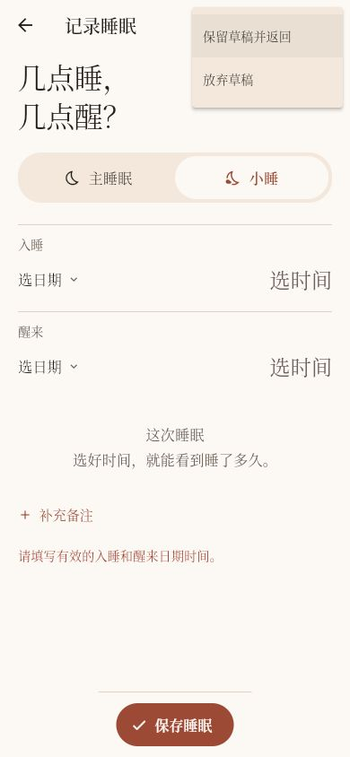

**079 · 打开睡眠放弃确认**

有明确确认步骤。

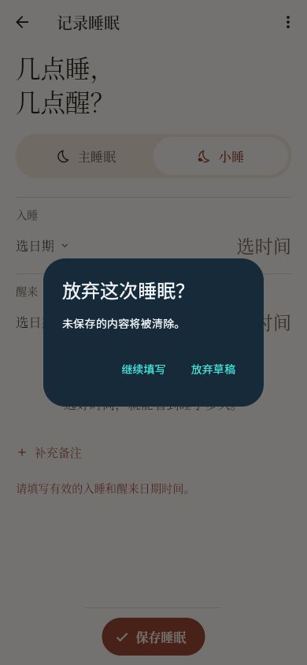

**080 · 取消睡眠放弃**

保留本次产生的睡眠草稿。

**081 · 新增睡眠返回**

返回账本，未提交睡眠事实。

### 日期与空段补记

**082 · 打开账本日期（390px）**

需横向滚动才能看到完整一周，右侧日期被裁出当前视野。

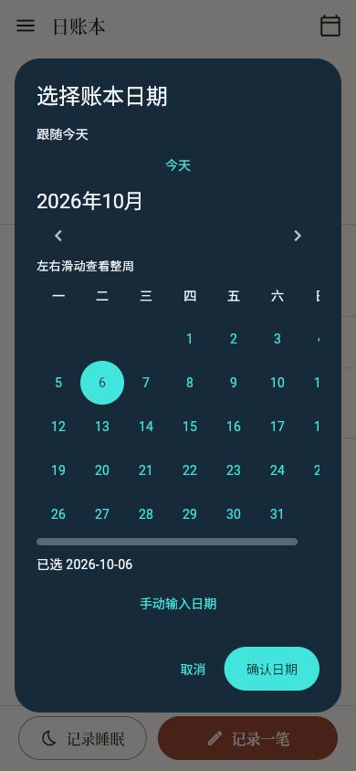

**083 · 切换手动账本日期**

中文手动日期入口可达。

**084 · 输入昨天日期**

选择 2026-10-05，检查有历史事实和复盘的状态。

**085 · 显示历史时间线**

日期切换成功；已记录事实与未处理空段清楚分开。

**086 · 打开 Unknown 详情**

已交代事实展示正确；实际区间等值在辅助树中缺失。

**087 · Unknown 返回**

回到原历史日期。

**088 · 点击 Gap 补记**

补记入口直接进入记录引导，保留所选空段上下文。

**089 · Gap 补记标题步**

标题输入和 Unknown 选项可达。

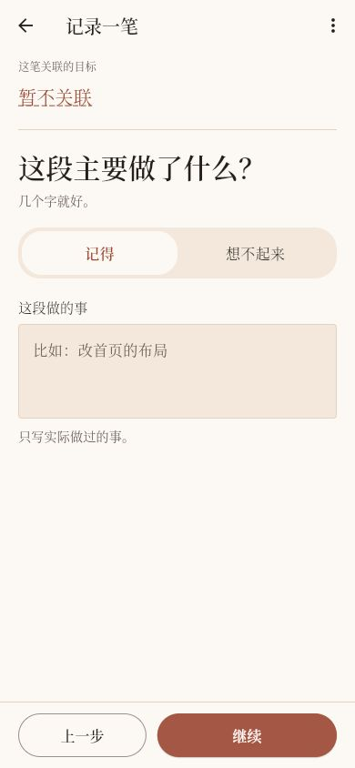

**090 · Gap 选择想不起来**

明确选择 Unknown 后继续，未自动把 Gap 持久化为事实。

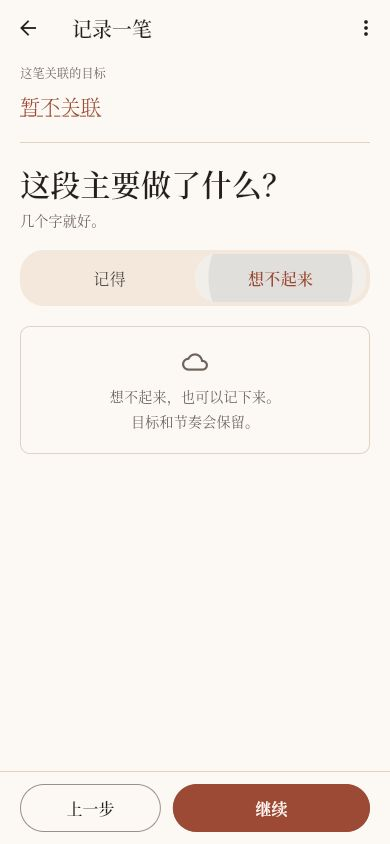

**091 · Gap 时间预填**

时间范围对应所选空段；本次没有完成提交。

**092 · Gap 补记返回**

返回历史时间线，事实没有新增。

**093 · 历史页打开更多**

准备检查“时间分布说明”。

**094 · 点击时间分布说明**

菜单关闭后仍是账本，说明没有出现；入口可复现无响应。

### 摘要

**095 · 切换摘要**

摘要可达，颜色和字号延续首页；与日期选择共享当前日期。

**096 · 摘要进入记录睡眠**

入口可达，仍进入相同睡眠编辑流程。

**097 · 睡眠返回摘要**

回到摘要，标签上下文保留。

### 复盘

**098 · 切换复盘概览**

旧式控件与纸色首页混合，重复日期控制和解释文字使层级拥挤。

**099 · 打开复盘编辑**

整页恢复旧深色与青色，没有延续主界面风格。

**100 · 展开复盘事实区**

活动、睡眠、空段解释密集，应保持事实口径并整理信息层级。

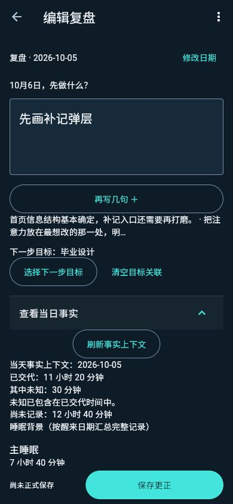

**101 · 展开复盘额外字段**

附加字段较多，主要解释与明日第一步的优先级需要重排。

**102 · 检查明日第一步输入**

输入可达，没有保存对已提交复盘的修改。

**103 · 打开复盘目标选择**

此处为旧式对话框，与活动目标选择弹层形态不同。

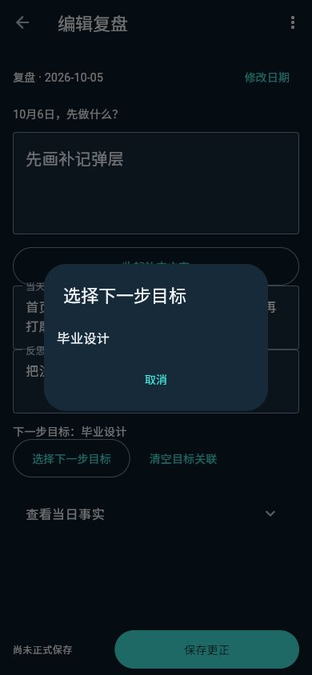

**104 · 取消复盘目标**

返回复盘编辑。

**105 · 打开复盘日期输入**

仅文本式日期编辑，与其他日期控件不一致。

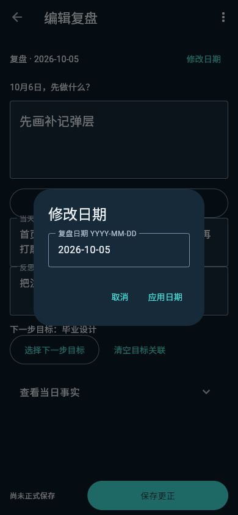

**106 · 取消复盘日期**

原日期保留。

**107 · 打开复盘更多**

保留草稿与放弃草稿可见。

**108 · 复盘返回**

返回复盘概览，保留本次编辑草稿。

**109 · 重新进入复盘编辑**

草稿可重新进入。

**110 · 再次打开复盘更多**

准备检查删除确认。

**111 · 打开删除复盘确认**

包含日期，但确认按钮仍为普通青色，与活动删除样式不同。

**112 · 取消复盘删除**

未删除已提交复盘。

**113 · 选择放弃复盘草稿**

准备观察放弃行为。

**114 · 放弃直接返回**

没有二次确认；本次审查生成的复盘草稿被清除，已提交复盘保留。

**115 · 切回历史时间线**

时间线内容恢复；截图下方标签指示仍带切换动画，不用于样式结论。

### 窄屏、桌面与语义复查

**116 · 首页 320px**

切换到 320×740，复查窄屏。

**117 · 账本日期 320px**

只看到周一至周五，横向滚动条明显；不是随机渲染溢出，而是当前布局策略。

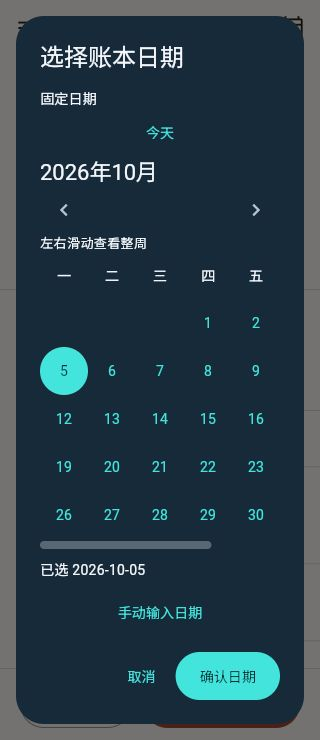

**118 · 取消窄屏日期**

正常返回账本。

**119 · 恢复 390px（剔除过渡帧）**

捕获到视口调整过渡状态，未用于缺陷判定；后续 120 为稳定状态。

**120 · 更多→目标复查**

390px 稳定画面，复查图表与此前记录。

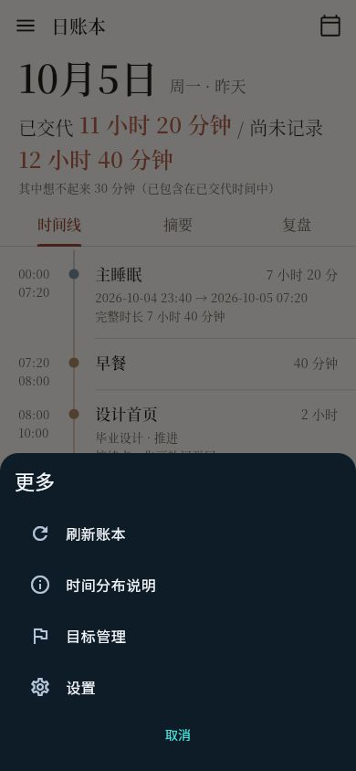

**121 · 重新打开目标列表**

目标数量未变化。

**122 · 重新打开柱状图**

图表时长可读，创建日期仍显示 1970 年。

**123 · 重新打开热力图**

检查周分布与设置入口。

**124 · 打开热力图范围菜单**

旧深色弹层问题再次复现。

**125 · 切换本月热力图**

历史空白与未来空白样式不同，但没有说明；缺少时长色阶刻度。

**126 · 滚动到此前记录**

列表显示活动与时长，但行没有可操作指示。

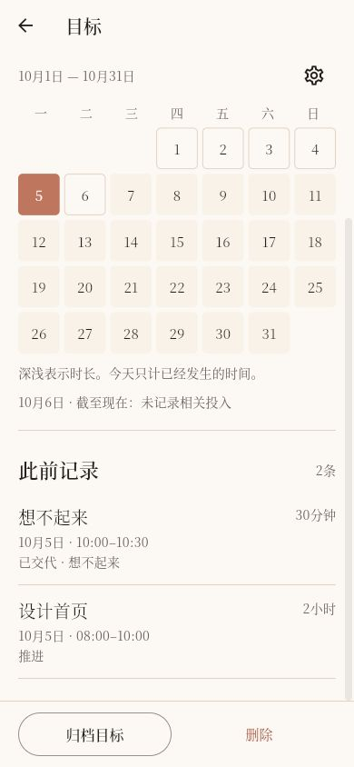

**127 · 点击此前记录**

点击“设计首页”没有导航；辅助树也没有对应按钮语义。

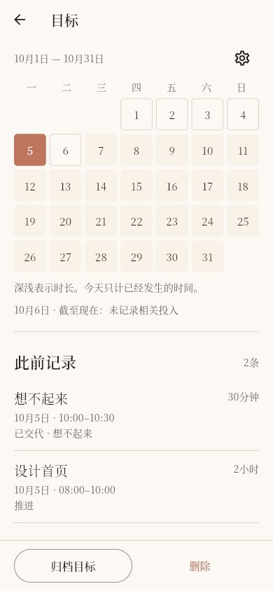

**128 · 目标详情桌面复查**

默认桌面视口下月热力格与内容横向放大，缺少内容最大宽度。

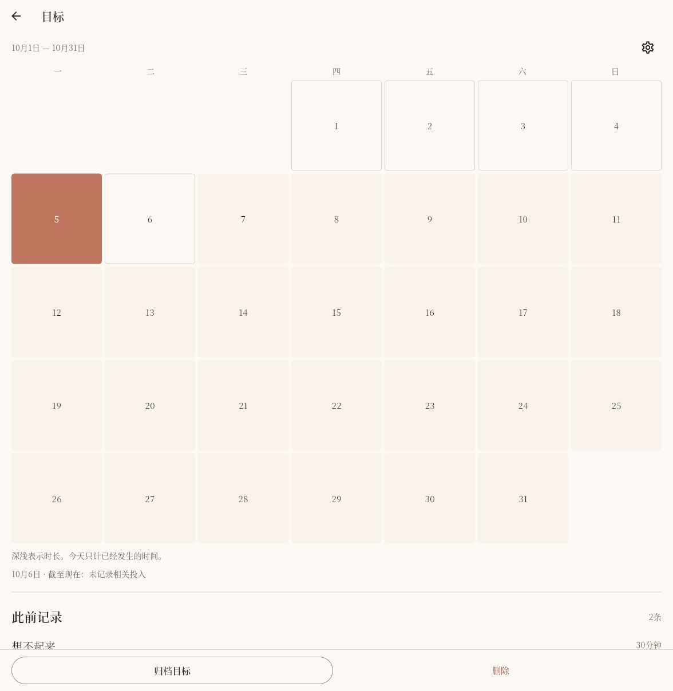

**129 · 目标列表桌面复查**

新建按钮横跨屏幕、内容过度分散，响应布局需与移动端分别处理。

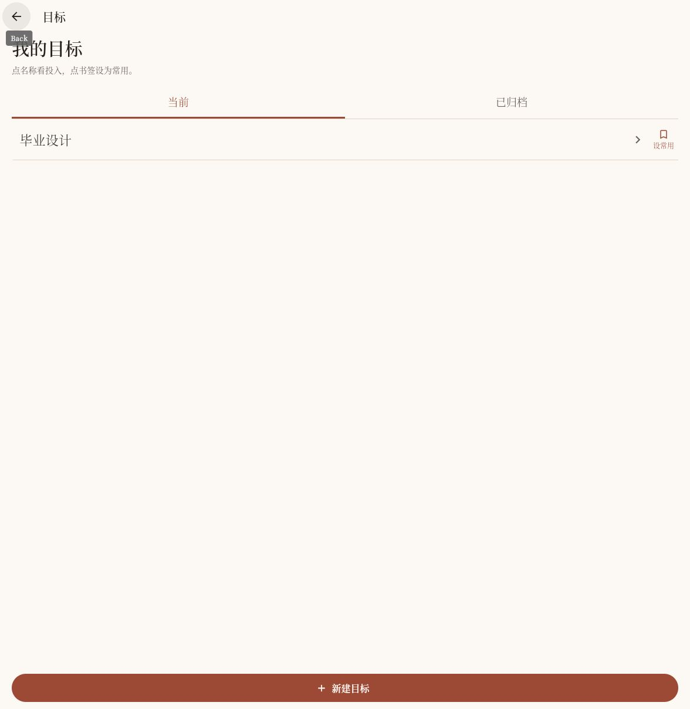

**130 · 桌面返回账本**

未新增或删除已提交事实。

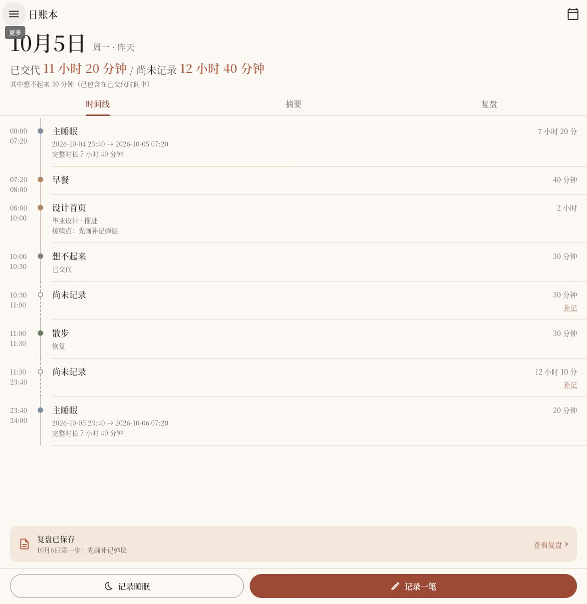

**131 · 桌面详情辅助树复查**

可见标题、08:00–10:00、毕业设计、推进与接续点，但辅助树没有这些完整值。

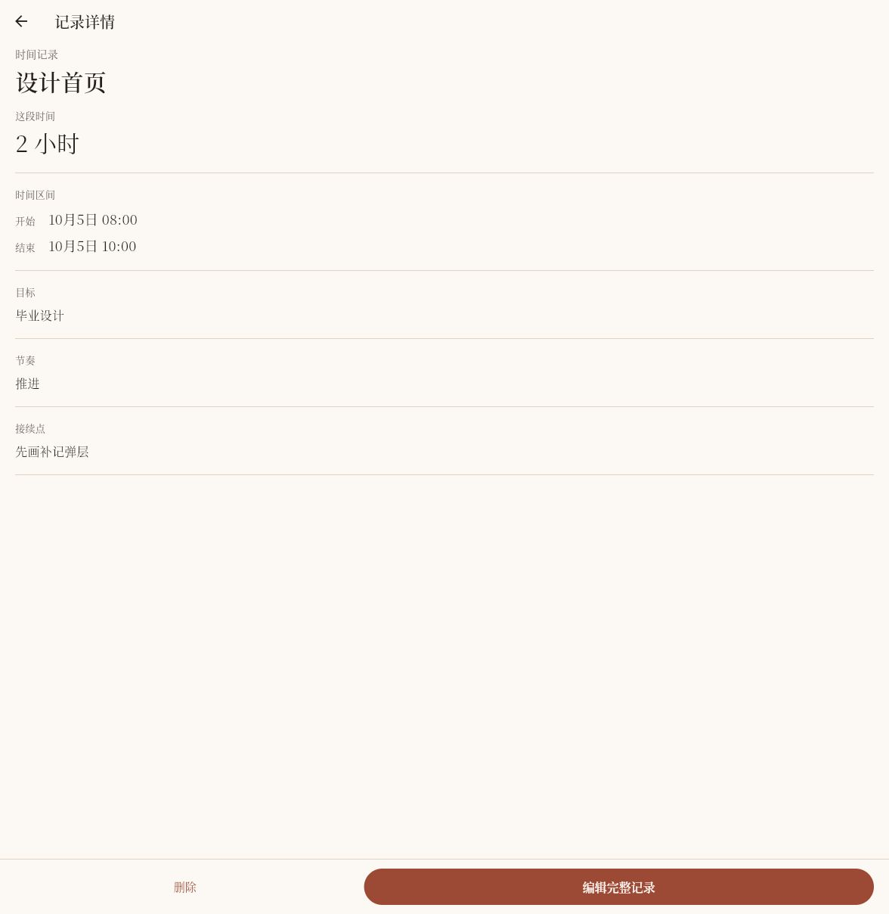

**132 · 审查结束返回账本**

返回 10 月 5 日时间线；浏览器警告、错误日志为空，视觉与行为问题仍存在。

