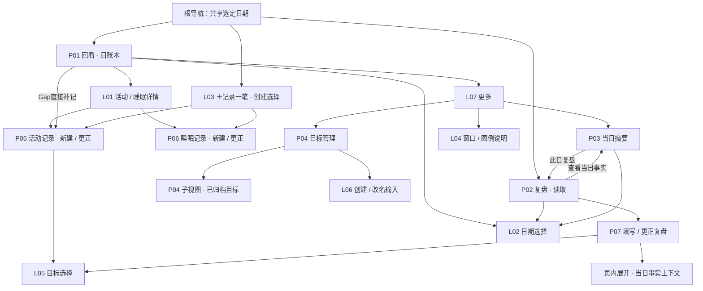

# 全产品页面体系与核心流程设计

**历史参考，暂停执行。** 全应用将按用户之后的新设计重做；当前前期交接只见[重做交接](UI_REBUILD_PLAN.md)。下文不作为继续设计或开发的任务入口。

任务：PRODUCT-IA-01 · 节点一：能力盘点、页面地图与职责 · 2026-10-04

**状态：节点一、节点二及节点三两批视觉稿均已确认，核心页面设计收束。** 本文件不修改产品领域规则，不授权实现，不标记任何 UI-T 完成。下文保留各节点提出时的推荐与范围描述作为历史记录；最新确认状态以本节为准。

### 活动记录更新（2026-10-05）

用户已基本认可问答引导，首版重点为节奏 → 事项 → 时间，目标持续显示，常用目标由用户指定且每笔可调整；时间全程可不用键盘，基础元件优先MD3。原表单作为设置中的另一种填写方式保留。具体见[三幕规格](GUIDED_RECORDING_DESIGN.md)与[Q-025 / Q-026](../domain/OPEN_QUESTIONS.md#q-025)。

三幕属于同一P05活动输入职责，不扩张根导航或新增领域对象。下文活动优先的旧流程、单页展开关系和HTML保留历史参考；问答方案按新规格执行。基本设计认可尚不构成新原型视觉、代码或平台验收通过。

### 活动流程更新（2026-10-10，Q-047）

用户决定问答顺序改为事实优先（做什么 → 系统建议时间 → 保存），Goal 与 Rhythm 移至保存后轻量理解层；三幕顺序规格转为历史参考。活动记录仍属同一P05活动输入职责，不扩张根导航或新增领域对象。见[Q-047](../domain/OPEN_QUESTIONS.md#q-047)。

### 设计确认记录（2026-10-04）

- 实施样板后续确认：用户对按 R06 HTML 还原的睡眠详情 Flutter 截图回复“可以通过”，该轮睡眠详情视觉验收通过。对应截图 `/tmp/opencode/home-r06/sleep-details-360.png`，实施与验证见 [HOME-IMPL-01报告](../reports/HOME_IMPL_01_REPORT.md)。配色仍留最后统一微调；此确认不替代真实设备验收，不自动授权下一批页面实施。

- 节点一：用户明确回复“确认节点一，继续核心流程线框”，确认页面体系与职责。
- 节点二：[核心流程线框](product-core-flow-wireframes.html)与[输入校准稿](editor-input-calibration.html)经连续校准后定稿；不常驻“可选／必填”标签，使用层级、展开入口与已填摘要表达补充信息。
- 节点三第一批：用户回复“符合”，确认[活动、睡眠、复盘编辑视觉稿](editor-visual-spec.html)。
- 节点三第二批：用户回复“确认这一批”，确认[阅读与管理视觉稿](reading-management-visual-spec.html)，包括复盘读取、当日摘要、目标管理、活动/睡眠详情、目标选择及代表性空态、失败态、归档管理。
- 上述 HTML 中提案时的“待确认”标注作为历史文本保留，由本记录更新其状态。设计确认不等于代码实现、真实平台验证或工程验收通过。
- 下一阶段为主页样板实施与同数据、同视口视觉验收，须取得实施授权后开始；主页样板认可后再分批推广到编辑、阅读与管理页面。

## 0. 已确认的起点与本轮范围

- 用户在本会话明确说“确认此次的主页视觉”，随后要求开始全产品页面体系设计。
- [主页视觉规格](home-visual-calibration-spec.html)因此作为**已确认的主页视觉基准**：深蓝、青色主动作、紧凑头部、连续时间轴、全天条、详情分层及“回看 / ＋记录一笔 / 复盘”。原 HTML 保留提案时文本；此处记录后续确认，不把确认误写成已实现或平台验收通过。
- 主页实施暂缓。此次只新增本设计文档，既有代码、测试、任务状态与其他人的工作区改动保留。
- 本轮交付页面体系，不提前制作整套高保真页面；下文地图是导航与职责图，不是已经实现的路由图。

### 依据

优先使用 [Source of Truth](../../time-ledger-domain-model-v4-proposal.md) §4–8、11–30、37–38，以及 [DOMAIN_RULES](../domain/DOMAIN_RULES.md)、[DOMAIN_MODEL](../domain/DOMAIN_MODEL.md)、[DERIVED_MODELS](../domain/DERIVED_MODELS.md)、[OPEN_QUESTIONS](../domain/OPEN_QUESTIONS.md)、[PRODUCT_DEFINITION](../product/PRODUCT_DEFINITION.md)、[PRODUCT_PRINCIPLES](../product/PRODUCT_PRINCIPLES.md)、[MVP_SCOPE](MVP_SCOPE.md)。Q-001–023 已有决定；不把旧候选或源提案的历史讨论重新当作需求。

核查对象为当前工作区的实际页面和主应用接线，未只依据旧交付报告。文末列出代码证据；“现有”仅表示静态可达，不表示本轮完成运行验证。

## 1. 推荐结构：两个目的地，七类全屏界面

**回看负责还原事实，摘要负责理解事实分布，复盘负责保存用户解释与下一步。** 创建是贯穿它们的动作，不另建一个空白“创建首页”。

| 层级 | 界面类型 | 数量口径 |
| --- | --- | --- |
| 一级目的地 | P01 日账本、P02 每日复盘读取 | 2 个，显示根底栏 |
| 次级阅读 / 管理页 | P03 当日摘要、P04 目标管理 | 2 类；已归档目标是 P04 子视图 |
| 专注输入页 | P05 活动记录、P06 睡眠记录、P07 复盘编辑 | 3 类；新建/更正/恢复草稿是状态，不另算页面 |
| 轻量交互层 | L01–L08：详情、日期、创建选择、说明、目标选择、目标名称输入、操作菜单、确认 | 无独立底栏，不升级一级目的地 |

准确计数为 **7 类全屏界面（2+2+3）**，其中主页已确认，其余6类仍需设计。页面类型不等于 Dart 文件数，也不等于每个状态都建一个路由。

### 页面地图（推荐目标结构）

地图省略重复返回箭头：关闭交互层回原位置；输入页按草稿/正式保存结果返回来源；读页之间能返回来源。睡眠首次确认是条件入口，不是新一级页面。

### 为什么这样划分

- 时间顺序与按目标聚合解决不同问题，因此摘要保留独立页面；不塞满主页，也不删除摘要。
- 复盘先读已存文字，写作时进入专注输入；不会一点击“复盘”就自动修改已有内容。
- 活动和睡眠的必填信息不同，保留两种表单；新建、Gap补记、更正共用相应表单结构。
- Goal 只有名称与状态，管理和选择足够，不建目标项目主页。
- 输入页隐藏根底栏，减少误切换；保留系统返回与明确“保留草稿并返回”。网页同样保留此职责结构，宽屏排版在节点三确定。

## 2. 现有能力清单与落点

| 编号 | 当前已有能力 / 实际入口 | 推荐落点 | 保留要求 |
| --- | --- | --- | --- |
| C01 | 日账本日期切换、日历/手动日期、今天、刷新 | P01 + L02 + 更多 | 跟随今天/固定日期保留行为；日期状态降为辅助信息 |
| C02 | 时间轴、全天条、覆盖/Unknown/Gap | P01 | 所有事实参与覆盖，未来区域不变Gap，近似逐项传播 |
| C03 | Gap补记、候选Gap选择、手动时间 | P05 | Q-023建议逻辑不改；新草稿预填精度approximate，不因输入自动变exact |
| C04 | known/unknown、可选目标、节奏、原因/恢复细节、接续点、备注 | P05 / L01 | Unknown不强制空标题；转换不清空内容；节奏不强制目标 |
| C05 | 活动更正；账本行删除及删除收尾重试 | L01 → P05 / 删除确认 | 操作完整源ID；删除包括依附解释；已提交与未提交失败分开 |
| C06 | 主睡眠/小睡、跨日、独立精度、备注；更正/删除 | P06 / L01 | 睡眠不成为恢复；保留完整源事实 |
| C07 | 首次主睡眠确认、检查失败后重试或继续账本 | 条件提示 → P06 | 已记录不重复打扰，不以检查失败阻止记账 |
| C08 | 按醒来日期完整睡眠、多段分别显示与合计、小睡独立 | P03主展示；P01折叠入口 | 当天零点醒来的记录也可能只有摘要、没有当日切片 |
| C09 | 当日摘要：覆盖、完整睡眠、各目标总时长及四项细分、全局推进/卡住/恢复 | P03 | 全局节奏也保留；不能只保留参考图里的恢复而丢现有能力 |
| C10 | 复盘按日读取、概述/反思/第一步及目标、填写/更正 | P02 → P07 | 概述/反思可选，第一步必填且只有一个，意向日期为复盘日次日 |
| C11 | 更改复盘日期、已有日期冲突拒绝、复盘删除 | P07日期编辑 / 次级删除 | 不覆盖其他复盘；删除不删除时间事实；更改日期不是新建副本 |
| C12 | 复盘读取页和编辑页内事实上下文及刷新 | P02进入P03；P07页内展开 | 刷新事实不替换用户文字，草稿不充当已存复盘 |
| C13 | 目标创建、改名、归档、恢复、删除；当前/归档列表 | P04 + L06 + 菜单 | 有引用的删除执行归档；同名仍按ID独立；改名影响历史展示 |
| C14 | 活动/第一步目标选择与清除、已有归档关联显示 | L05 | 不新增归档关联；选目标与管理目标不是同一任务 |
| C15 | 活动/睡眠/复盘草稿自动保留、恢复、放弃、保存/删除后收尾 | 对应输入页及原上下文 | newEntry/gap/edit身份不变，不增加草稿中心，不将目标名称输入擅自纳入持久化草稿承诺 |
| C16 | 读取、保存、草稿存储、冲突、原记录缺失、提交后收尾失败 | 发生问题的页面 / 来源页恢复区 | 简化正常态不能移除错误、重试与安全离开路径 |
| C17 | 根导航共享日期、返回、各目的地阅读位置 | 根导航及返回合同 | 不为新层级重置日期，不以列表像素位置代替源事实锚点 |

## 3. 页面职责与信息颗粒度

“默认显示”指页面初始内容结构，不要求全部塞进一屏；有值的长文本完整可读，滚动可接受。已填可选项以摘要提示其存在；错误发生在折叠区时自动展开或明确定位。

| 页面 | 用户来做什么 | 默认显示 | 按需展开 / 次级操作 | 主要动作与返回 |
| --- | --- | --- | --- | --- |
| P01 日账本 | 回忆一天按时间发生什么，补缺口 | 已确认主页：自然日期、精简覆盖、全天条、事实/Gap连续时间轴 | L01完整事实；窗口/图例；完整睡眠折叠；更多里的摘要和目标 | 中央创建；Gap补记；点击事实读详情 |
| P02 每日复盘读取 | 看自己如何解释这一天、下一步是什么 | 日期；已存概述/反思（有值才占主要正文）；完整第一步及其意向日期、目标；无复盘的中性提示 | “查看当日事实”进P03；刷新在次级入口。缺失可选文字不形成大片占位 | 无记录“填写复盘”，有记录“编辑复盘”；系统返回回账本 |
| P03 当日摘要 | 理解时间分布与目标节奏 | 日期及今天的截至时刻；睡眠背景；有记录的目标总时长和推进/卡住；全局节奏概览；紧凑覆盖说明 | 每目标展开完整四项细分；完整睡眠各段与主睡眠/小睡合计；窗口与近似说明。所有已有输出均可访问 | “此日复盘”；返回来源，保留原有日期共享行为 |
| P04 目标管理 | 维护可用于时间归属的目标 | 当前目标列表、创建目标入口、已归档入口 | 创建/改名名称输入；行菜单归档/删除；已归档子视图恢复/改名/删除 | 创建；管理单个目标；完成回列表，返回账本等来源 |
| P05 活动记录 | 记录或更正一段做过的事 | 活动名称、记得/想不起来、可修改区间及各自精度；缺时间时必须可见输入/候选；正式保存按钮；简洁草稿状态 | 可选目标、节奏、备注；有节奏时接续点及适用原因/恢复细节；放弃草稿 | 保存到账本/保存更正；返回保留草稿，放弃需明确动作 |
| P06 睡眠记录 | 确认何时睡、何时醒 | 主睡眠/小睡、入睡和醒来的完整日期时间、独立精度、完整时长提示、保存与草稿状态 | 备注；更正状态的删除入口 | 正式保存/保存更正；返回保留草稿；不要求目标或节奏 |
| P07 复盘编辑 | 写解释并留下一次可开始的动作 | 当前复盘日期（可修改）、第一步输入及次日日期；概述/反思可选输入区；保存与草稿状态 | 可选目标、页内事实上下文及刷新；已有复盘删除；放弃草稿 | 保存复盘/保存更正；返回P02；日期成功更正后读取新日期 |

### 轻量交互层职责

| 层 | 承载方式建议 | 内容与退出 |
| --- | --- | --- |
| L01 事实详情 | 可滚动底部面板，大字时允许占满可用高度 | 标题/原始区间/精度/当日与完整时长，完整目标/解释/备注；编辑、删除；关闭回原行。活动与睡眠使用同一阅读层级，不强行相同字段 |
| L02 日期选择 | 日期选择对话层 | 日历、手动日期、今天、当前模式说明；选日/取消遵循既有刷新合同。浏览日期与P07更改正式复盘日期是不同操作 |
| L03 创建选择 | 两项动作面板 | 记录活动 / 记录睡眠；关闭不建事实、不丢既有草稿 |
| L04 时间分布说明 | 信息面板 | 实际窗口、设备时区、图例、Unknown已计入、未来不可补记；不提供新分类 |
| L05 目标选择 | 列表选择层 | 可选活跃目标、清除关联、原归档引用说明；同名按ID处理；取消不变更关联 |
| L06 目标名称输入 | 单字段对话层 | 创建或改名；保存/取消/错误。不是独立“目标详情页” |
| L07 更多 / 行菜单 | 动作菜单 | 提供次级入口；错误恢复不藏入菜单 |
| L08 确认 | 确认对话层 | 删除对象、影响范围、取消和确认；不绕过既有确认语义 |

## 4. 三个阅读页面如何避免重复

| 信息 | P01 日账本 | P03 当日摘要 | P02 / P07 复盘 |
| --- | --- | --- | --- |
| 时间顺序、Gap补记 | 主内容 | 不再重复整条时间轴 | 需要时回账本，不嵌入第二条完整时间轴 |
| 已交代/未知/未记录 | 简短概览 | 可独立理解的紧凑背景，不再做第二块巨大头部 | 读取页通过摘要查看；编辑页在上下文展开内 |
| 完整睡眠 | 单条详情与末尾折叠入口 | 汇总主位置，按醒来日明确口径 | 引用当前事实，不写回复盘字段 |
| 目标与节奏 | 单条可选标签 | 总量与四项细分、全局节奏 | 上下文按需查阅，用户文字优先 |
| 概述、反思、第一步 | 本次主页不额外增加复盘卡 | 保留进入此日复盘的入口 | 正式阅读/编辑的主内容 |

**必要的重复可以保留。** 摘要作为独立页面仍需日期与数据范围；去重目标是避免整套大组件反复铺开，不是删除上下文。

## 5. 流程骨架与导航合同

本节只确认去向和退出，具体逐屏线框及按钮位置在节点二制作。

| 流程 | 起点 → 操作 → 终点 | 必须保留的分支 |
| --- | --- | --- |
| F01 补账 | P01 Gap → P05 → P01重读 | 预填可修改、保存Unknown、冲突手动调整、保留草稿离开 |
| F02 查看与更正 | P01事实 → L01 → P05/P06 → 来源账本 | 始终完整源事实；取消不改正式记录；源记录不存在不能重建 |
| F03 删除 | L01或已有编辑删除入口 → L08 → 来源页更新 | 时间块连解释删除；睡眠删完整记录；提交后失败只重试收尾，不误示未删除 |
| F04 新建与恢复 | L03 → P05/P06 → 保存或离开 → 从原上下文恢复 | 普通活动时间建议遵循Q-023；睡眠首次提示复用P06 |
| F05 从事实到复盘 | P01 → P03 → P02 → P07 → P02 | 不先要求补完Gap；上下文读取失败不抹输入；改日期冲突拒绝覆盖 |
| F06 目标管理与使用 | P01更多 → P04创建 → 返回 → P05/P07的L05选择 | 现有选择器无就地创建；节点一保留现有路径，暂不增加路由能力 |
| F07 删除复盘 | P02 → P07次级删除 → L08 → P02空态 | 时间事实保留，第一步随复盘删除，草稿清理失败独立恢复 |

### 日期与返回

- 根账本和复盘共享选定日，但分别保留阅读位置；摘要现有接线也共享日期。浏览历史不偷偷跳回今天。
- 同一个复盘读取职责只有P02，不因从摘要进入而设计第二种内容或第二套日期控件。**保留入口来源的返回路径**：从摘要推入的读取视图返回摘要，根复盘系统返回回账本；具体路由技术方案不在此替换。
- 输入流程绑定打开时的草稿上下文，不能被背景日期切换重定向。更改复盘日期成功后遵循现有返回新日期合同。
- P07查看事实采用页内展开，避免写作中因打开另一个可切日期页面而混淆所编辑的复盘日期。
- 新详情层的关闭、编辑返回、删除后详情失效如何处理，作为节点二必画状态；不修改已有controller的保存/清理语义。

## 6. 关键状态责任表

| 状态 | 负责界面 | 呈现要求 |
| --- | --- | --- |
| 无事实但窗口非空 | P01/P03 | 整窗Gap可补；不是0小时睡眠或用户没做事 |
| 今天/历史/未来 | P01/P03及复盘事实区 | 今天截至当前时刻；历史完整自然日；未来不制造Gap，保留允许未来事实的规则 |
| 无复盘 / 有草稿 / 有正式复盘 | P02/P07 | 三者不混淆；草稿恢复提示出现在对应输入上下文，不推断或新增全局草稿索引 |
| 初次加载/重读失败 | 对应阅读页 | 加载、无数据和失败分别表达；有旧数据须明确未更新 |
| 保存冲突/校验失败 | P05/P06/P07 | 输入保留，定位问题；不自动拆分覆盖；折叠字段有错误也能发现 |
| 草稿存储失败 | 对应输入页 | 不声称已保留；提供既有重试和退出处理 |
| 正式提交成功但清理/重读失败 | 提交页/来源恢复区 | 告知正式结果，保留收尾重试；不再次重复提交 |
| 同名目标/已归档引用 | P04/L05/P03及详情 | 同名条目独立，不自动合并；已有归档关联可展示但不新增关联。可辨提示的具体样式留节点二核查 |
| 长文/大字/键盘/Web焦点 | 所有阅读与输入层 | 自然增高与滚动；关键动作不被遮住；精度、状态文字不靠颜色替代 |

## 7. 当前发现与设计取舍

1. **功能主要已存在，缺的是组织。** 无需为每个领域对象建一个导航页，也不需要补“睡眠中心”“节奏管理”“第一步任务页”。
2. **现有摘要在四处复用内容。** 分别收敛为主页简概览、摘要完整阅读、复盘读取的入口、复盘编辑的展开上下文。
3. **当前复盘有根目的地与摘要推入两种入口。** 保留返回来源，但统一页面职责和内容。
4. **删除入口不一致。** 活动在列表，睡眠/复盘在编辑页。已确认主页用L01收起活动删除；睡眠详情删除继续接现有删除流程，复盘保留编辑层删除，避免此次视觉组织演变为重写业务接口。
5. **名称不一致。** 入口“当日摘要”对应页面“基础摘要”；建议用户可见统一为“当日摘要”。“编辑复盘草稿”建议改为“编辑复盘”，另行清晰显示未正式保存状态，而不是用技术状态作为页面职责名称。
6. **目标选择缺少就地创建入口，但功能可达。** 当前通过目标管理创建，再回表单选择。是否需要缩短此流程可在节点二看到实际往返后判断，本节点不偷偷加入新接线要求。

## 8. 本节点需确认的结构决定

以下是推荐的交互组织，不是新的领域决定；用户可整体确认，也可只指出不合适的项。

| 编号 | 推荐决定 | 主要代价 / 收益 |
| --- | --- | --- |
| IA-01 | 保持回看、复盘两个一级目的地，中央为创建 | 导航稳定；摘要与目标多一次进入，但不挤占主流程 |
| IA-02 | 当日摘要独立次级页；复盘不常驻完整事实统计 | 职责清晰、写作更轻；阅读完整数据需要进入摘要或展开上下文 |
| IA-03 | 普通事实先读详情，再编辑；Gap直接补记 | 查看更轻，编辑多一次点击；与已确认主页一致 |
| IA-04 | 活动/睡眠/复盘编辑是专注全屏流程，可选细节分层 | 减少首层负担；已填值、错误和恢复状态需可见提示 |
| IA-05 | 目标管理为一个页面族；不设目标项目主页和独立草稿中心 | 保持产品小规模；目标创建暂时仍走管理入口 |

**领域阻塞：** 本轮尚未发现必须新增产品规则才能完成节点一的事项。上表仍待结构确认；不得将其写成已经批准。节点二如发现合同不能回答的问题，按AGENTS流程登记/请求决定。

## 9. 下一节点与验收

节点一确认后，节点二以主页样例（2026-10-02，跨日睡眠、早餐、设计首页、Unknown、Gap、散步）为主数据制作可查看的线框流程板。补充复盘文字仅作明确标注的样例，不声称来自已保存数据。

节点二必须交付：

- P01–P07及L01–L08在F01–F07中的逐屏去向、主要按钮、默认与展开内容；不只画孤立的正常态页面。
- 至少走通一次放弃/保留草稿、读取失败、保存冲突、已提交收尾失败、复盘改日期冲突、目标归档引用。
- 说明返回后的日期、滚动锚点、草稿和正式数据分别处于什么状态。
- 明确320/360/412手机视口、大字与Web键盘导航对层级的影响，不以线框稿代替工程验证。

节点三再形成关键页面高保真视觉与尺寸规格；工程实施与必要计划更新在设计确认后另行授权。工程验收证明行为与合同正确，视觉验收检查整套阅读节奏与信息层级，二者分开。

### 本轮核查与代码证据

以下路径均相对仓库根；行号为本轮当前工作区静态核查时位置：

| 证据 | 路径与行号 |
| --- | --- |
| 创建、更多、摘要与复盘共享日期、源事实编辑、根导航 | `lib/app/main_app.dart:344–552` |
| 生产能力注入 | `lib/app/bootstrap/app_bootstrap.dart:206–246` |
| 活动内容、时间精度、候选Gap、可选细节及保存/返回 | `lib/features/ledger/presentation/recording_form.dart:660–864` |
| 活动删除和收尾恢复 | `lib/features/ledger/presentation/day_ledger_page.dart:235–320,394–417` |
| 睡眠类型、时间、精度、备注、存储/提交失败及删除 | `lib/features/ledger/presentation/sleep_form.dart:100–263` |
| 摘要当前展示和日期入口 | `lib/features/ledger/presentation/day_summary_page.dart:136–219` |
| 每目标四项、全局三项 | `lib/features/ledger/presentation/goal_rhythm_summary_view.dart:21–63` |
| 复盘读取、表单接线、返回新日期、常驻事实上下文 | `lib/features/review/presentation/review_context_page.dart:164–307` |
| 复盘改日期、目标、保存/删除、草稿、事实上下文 | `lib/features/review/presentation/review_form.dart:210–397` |
| 目标创建、归档子页、改名、引用删除语义及恢复 | `lib/features/goals/presentation/goals_page.dart:115–315` |

文档验收：C01–C17均有页面落点；P01–P07均有入口与退出；F01–F07覆盖主要闭环；领域边界引用Q-001/003–014/019–023；相对链接与编号须核对。未修改Dart，因此格式化、静态分析、Flutter测试为N/A；不声称当前工程基线通过。

**停止点：节点一交付后等待用户确认页面分工，再进入核心流程线框设计。**
