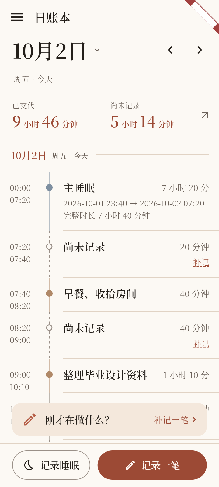
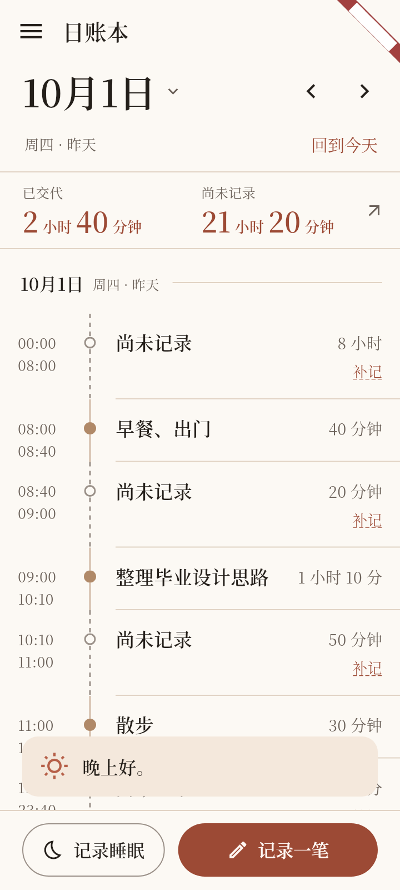
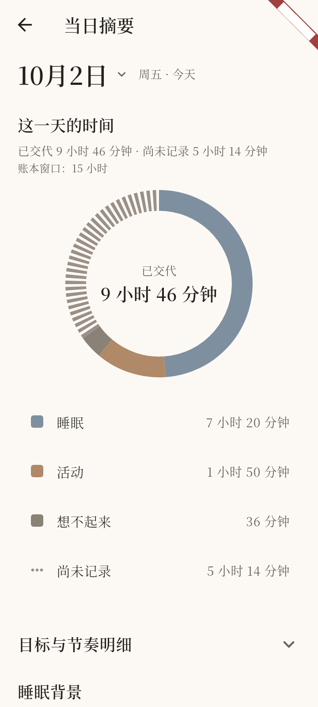
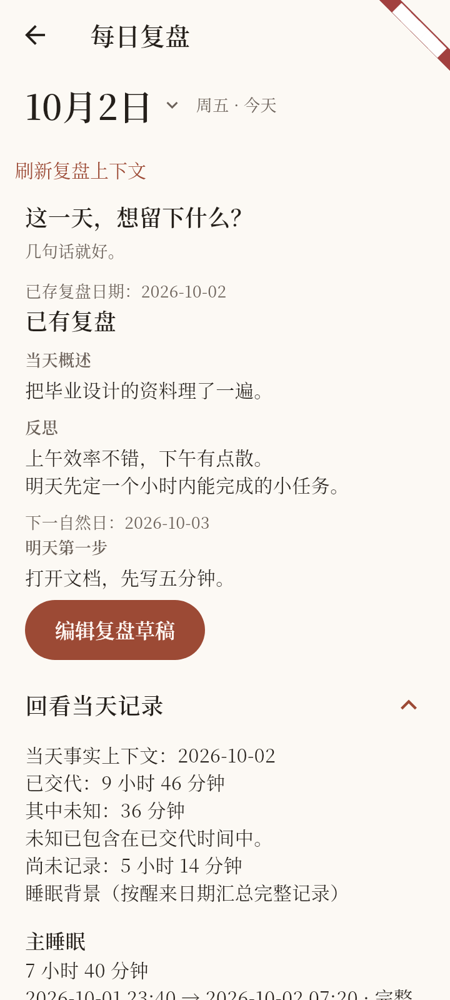
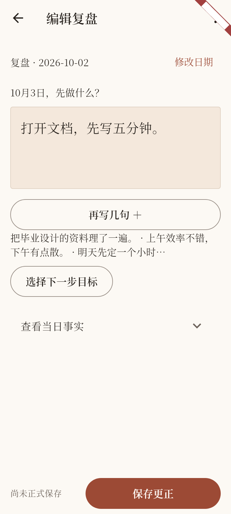

# 首页导航与三页改版 · 时间账本 / 当日摘要 / 每日复盘

**状态：COMPLETE。日期：2026-10-07。** 本次是用户以交互原型为参考直接授权的首页导航与三页改版，不推进其他任务。原型仅是视觉与交互参考，不是生产代码或领域事实来源；示例日期、固定时刻、演示记录、简化表单和有限日期范围未照搬。

## 范围与依据

用户授权范围：

1. 取消首页“时间线 / 摘要 / 复盘”标签页；首页只保留时间账本，摘要与每日复盘改为侧边栏独立页面；目标、设置入口保留，不因原型按钮不可用而禁用正式功能。
2. 首页采用跨日期连续时间轴：按日期分组、日期分隔与吸顶日期提示；上下连续滚动，左右滑动按天定位；点击日期打开日历，历史日期提供“回到今天”；屏幕边缘手势与侧边栏 / 系统返回协调。
3. 明确日期与统计关联：顶部日期代表当前浏览日期，“已交代 / 尚未记录”只统计该日；跨日滚动、滑动切日、日历跳转共用同一日期规则；从首页进入摘要 / 复盘继承当前日期，进入后各页独立管理；返回首页恢复原日期与阅读位置；复盘编辑中的日期不被后台刷新改写。
4. 首页视觉：米色底、衬线、砖红强调；覆盖统计改为双列小标签与时长，数字 / 单位分层；连续时间轨道、节点与日期边界强化，事实实线、未记录虚线空心节点。
5. 摘要页独立重排：保留 fl_chart 与 Material 3 图例、真实统计、占比选择、睡眠背景、目标与节奏信息，不新增效率评分。
6. 复盘页独立重排：按 DailyReview 与下一步领域合同组织阅读、填写与保存，保留查看当天记录的入口；保存接入正式能力，离开页面妥善处理草稿，不使用原型中的本地假保存。

边界：跨日展示保留事实身份与完整起止，不在午夜拆分持久化记录、不重复统计；Unknown 仍计入已交代，Gap 保持派生，今天未来部分不计 Gap；保留现有记录初始化、编辑、删除、刷新与持久化规则；不接入 AI、不扩展周 / 月统计、不引入无关依赖。

追溯：[Q-027 补充](../domain/OPEN_QUESTIONS.md#q-027)、[前端交接小节](../planning/UI_REBUILD_PLAN.md#首页导航与三页改版2026-10-07后续授权)。本轮不需要外部资料研究，仓库定位使用既有文档与 `rg` 检索；实现、集成与最终验证由主 agent 完成。

## 修改文件与行为

| 文件 | 改动 |
| --- | --- |
| `lib/app/main_app.dart` | 移除旧页签日期选择对象；摘要 / 复盘改为独立路由；建议卡改读跨日窗口控制器的当日投影 |
| `lib/features/ledger/presentation/home/home_shell.dart` | 无标签页首页壳：MD3 `NavigationDrawer`（时间账本 / 当日摘要 / 每日复盘 / 我的目标 / 设置）、横向滑动切日（边缘 32 像素保留、水平位移 ≥64 且大于 1.6 倍垂直位移）、“回到今天”与跨午夜跟随 |
| `lib/features/ledger/presentation/home/ledger_feed_controller.dart`（新增） | 跨日期窗口：焦点日、14 天窗口、向前扩展 7 天、整个窗口共用同一 `now`、跳转日 reveal 请求、刷新与数据版本 |
| `lib/features/ledger/presentation/home/home_timeline_tab.dart` | 连续时间轴：日期分组、日期分隔（可点区域 ≥48）、吸顶日期、跨日滚动同步焦点日、阅读位置恢复、底部填充使其可滚动到最后一天 |
| `lib/features/ledger/presentation/home/home_day_header.dart` | 顶部日期 = 浏览日期，前后一天、日历入口、“回到今天”；日期可点区域 ≥48 |
| `lib/features/ledger/presentation/home/home_coverage_line.dart` | 双列“已交代 / 尚未记录”小标签 + 时长，数字与单位分层、长时长整体缩放；合并样式与数字同色 |
| `lib/features/ledger/presentation/day_page_header.dart`（新增） | 独立页面（摘要 / 复盘）日期头：各自管理日期、可点区域 ≥48、历史日期“回到今天” |
| `lib/features/ledger/presentation/day_summary_page.dart` | 独立“当日摘要”页；日期经 `DayPageHeader`，正文复用同一单日投影 |
| `lib/features/ledger/presentation/home/home_summary_tab.dart` | 摘要按“这一天的时间 → 目标投入 → 目标与节奏明细（折叠）→ 睡眠背景”重排；恢复“账本窗口”口径展示；保留 fl_chart 圆环与 Material 3 图例 |
| `lib/features/review/presentation/review_context_page.dart` | 独立“每日复盘”页：日期独立管理、事实上下文默认展开、打开表单入口；无旧页签选择状态 |
| `test/app/home_feed_flow_test.dart`、`home_navigation_flow_test.dart`（新增） | 跨日滚动、滑动切日手势边界、日历跳转 / 回到今天、日期与统计归属、摘要 / 复盘日期继承与首页阅读位置恢复 |
| `test/app/home_feed_nav_capture_test.dart`（新增）、`test/app/home_r1_visual_test.dart` | 组件截图（360 / 320 / 大字）与视觉断言 |
| `test/support/home_feed.dart`（新增）、`test/support/root_navigation.dart`、`test/support/ledger_date_selection.dart` | 适配抽屉导航、日期头与连续轴；覆盖值按 `Text.rich` 合并文本匹配 |
| `test/features/ledger/presentation/` 摘要 / 复盘 / 日期字段相关用例 | 适配新日期头文案、摘要覆盖行格式、账本窗口与折叠区块；保留领域断言与真实保存路径 |
| `TASKS.md`、`docs/planning/UI_REBUILD_PLAN.md`、`docs/domain/OPEN_QUESTIONS.md` | 记录本轮决定、实施文件、验证结果与截图；原“时间线 / 摘要 / 复盘”标签页方案标记为被取代 |

行为要点：首页只有时间账本；摘要与复盘为独立页面并可返回首页恢复原日期与阅读位置；日期与统计归属使用同一更新规则；跨日事实（睡眠 / 活动）在连续轴中按日切片展示、保留完整起止与同一事实身份，点击仍进入同一编辑入口；Unknown 计入已交代、Gap 派生，今天未来部分不计 Gap；摘要在既有投影上重排并保留真实统计与占比选择；复盘走既有正式保存与草稿路径。

## 收尾阶段修复的本轮回归

全量比对改动前后失败集合时发现 14 条由本轮改版引起的回归（基线失败清单中不存在），已全部修复；103 项历史失败保持原状、未顺手处理：

1. 摘要重排丢失“账本窗口”展示（23 / 25 小时日口径）→ 在“这一天的时间”恢复辅助行。
2. 首页日期与时间轴日期分隔的可点区域在 320 / 2.0、360 / 1.0 只有 37 / 27 高 → 提升到 ≥48（含摘要 / 复盘独立页日期头）。
3. 覆盖值 `Text.rich` 根样式与数字 / 单位颜色不一致，渲染对比度采样降到 2.68 → 合并样式与数字同色后通过 4.5 阈值。
4. 导航辅助中“返回账本”动作被前置返回吞掉 → 改为真实回退（独立页 → 首页），并更新受影响的旧导航断言。
5. 旧用例对已授权改动（旧标签页 key、旧日期文案、旧覆盖标签格式、已移除的“刷新摘要”按钮）的断言 → 更新为新的真实交互路径（返回本页重读、抽屉入口、新日期头文案），保留原有领域与位置断言。

## 实际验证

均在仓库根目录执行。

| 命令 | 最终结果 |
| --- | --- |
| `dart format --output=none --set-exit-if-changed <31 个改动 / 新增 Dart 文件>` | 退出 0，31 文件，0 changed |
| `flutter analyze --no-pub` | 退出 0，No issues found |
| `flutter test --no-pub test/app/home_feed_flow_test.dart test/app/home_navigation_flow_test.dart test/app/home_r1_visual_test.dart test/app/home_feed_nav_capture_test.dart test/app/home_suggestion_entry_test.dart test/app/review_context_entry_test.dart test/app/review_form_entry_test.dart test/app/review_submission_flow_test.dart test/app/review_draft_storage_test.dart test/features/ledger/presentation/home_summary_donut_test.dart test/features/ledger/presentation/day_summary_page_test.dart test/app/day_ledger_resolution_flow_test.dart` | 52 项通过、2 跳过；4 项失败均为改动前基线失败（`day_ledger_resolution_flow_test` 2 项、`day_summary_page_test` 2 项），非本轮回归 |
| 收尾修复的 14 条新增失败逐条 `--plain-name` 复跑 | 全部通过（含摘要 23 / 25 小时窗口、跨日窗口刷新、复盘删除日期、陈旧睡眠编辑、320 / 2.0 与 360 / 1.0 主题矩阵、导航矩阵两条） |
| `flutter test --no-pub`（全量） | `+775 ~11 -103`；失败集合与改动前基线（103 项）经 `--reporter json` 精确比对逐条一致，无新增、无基线状态变化 |
| `flutter build web` | 退出 0，生成 `build/web`（Wasm dry run 成功） |
| `flutter build apk --debug` | 退出 0，生成 `build/app/outputs/flutter-apk/app-debug.apk` |
| `git diff --check` | 退出 0 |

## 截图证据

以下截图由组件测试在 360 / 320 视口与大字设置下输出，已逐张查看；组件截图不等于真机安装或浏览器运行验收。

## 未验证与限制

- 未执行真机安装、系统返回手势或浏览器运行验收；手势与返回协调仅有组件级测试证据。
- 320 宽 + 大字下，时间轴记录的标题与时长会折行（内容不截断）；覆盖统计已按数字 / 单位分层并整体缩放。
- 复盘页“回看当天记录”沿用既有“已交代：…”事实文案格式，未在本轮范围重排。
- 103 项改动前既有失败（旧页面布局、时长“约”前缀、旧时间条与旧导航等）保持原状；本报告不把它们计为本轮结果或通过项。
- Web 构建产物仅本地生成，未部署；未接入 AI，未扩展周 / 月统计，未新增依赖。
