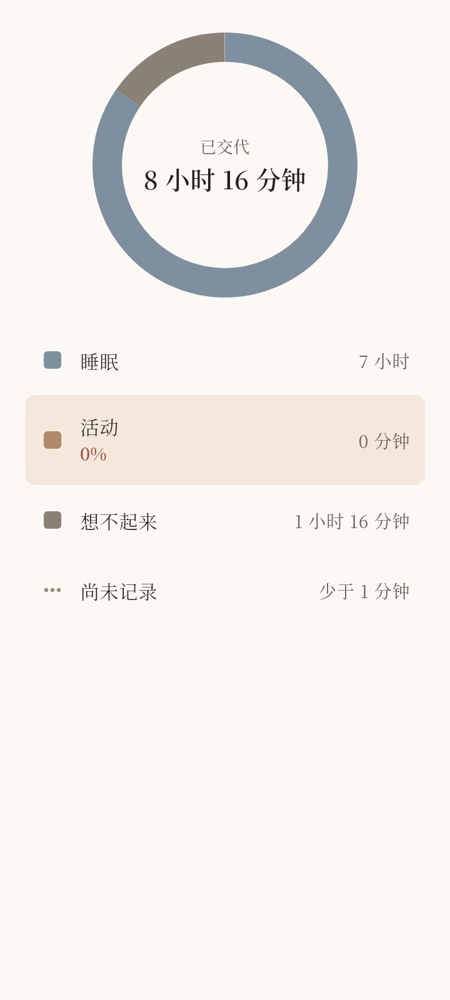
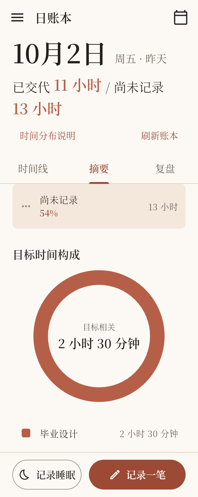

# 首页摘要 · fl_chart与Material 3图例替换

**状态：COMPLETE。日期：2026-10-07。** 本次是用户直接授权的首页图表替换，不执行下一项功能或其他页面重做。

## 范围与依据

用户在fl_chart / Syncfusion推荐后明确要求“请你使用这个来彻底完成吧”，采用首选fl_chart + Material 3 ListTile方案，并授权必要依赖接入。追溯见[源提案](../../time-ledger-domain-model-v4-proposal.md)、[Q-027](../domain/OPEN_QUESTIONS.md#q-027)及[前端交接](../planning/UI_REBUILD_PLAN.md#摘要环图与material-3图例2026-10-07后续授权)。

保留[LEDGER-002](../domain/DOMAIN_RULES.md#rule-ledger-002)的Unknown已交代子集、原始毫秒占比、自然日窗口、完整睡眠 / 当日切片区别及[摘要缺失表达](../domain/DOMAIN_RULES.md#摘要缺失表达q-021)。本轮不改事实、持久化、投影或时长格式化政策；上一轮删除的首页顶部Unknown说明保持删除。

按AGENTS委派有界只读code_mapper检查调用、测试、Gap样式与平台验证入口；主agent读取证据并负责依赖、实现、集成和最终验证。工作区原有活动 / 睡眠页面、控制器、测试及交接文档增量保留。

## 修改文件与行为

| 文件 | 改动 |
| --- | --- |
| `pubspec.yaml`、`pubspec.lock` | 固定fl_chart 1.2.0，必要间接依赖equatable 2.1.0；其他已锁包版本未变化 |
| `lib/features/ledger/presentation/home/home_donut_chart.dart` | 使用fl_chart PieChart替代两个自定义Painter，Material 3 ListTile承载图例；点击圆环 / 图例联动选择，再次点击取消 |
| `lib/features/ledger/presentation/home/home_summary_tab.dart` | 为一天 / 目标构成分别提供稳定Widget key，隔离两种图表的选择状态 |
| `test/features/ledger/presentation/home_summary_donut_test.dart` | 原4项扩展为11项，验证库接入、真实点击、比例 / Gap透明短段、零值、微小时长、空态、数据刷新、布局、长名称、键盘及Semantics |
| `test/app/home_r1_visual_test.dart` | 在既有320 / 360截图测试中增加滚动后的图例点击与占比验证；每个视口隔离页面状态 |
| 源提案、`OPEN_QUESTIONS.md`、`UI_REBUILD_PLAN.md` | 固定本次用户选择、实施授权与结果；沿原Q-027补充，不创建未决产品答案 |
| 本报告与`docs/reports/assets/home-summary-fl-chart/` | 保存验证范围与两张已检查截图 |

手机上圆环位于图例上方；内容宽度至少560且文字比例不超过1.3时并排。窄图例或大字模式将时长 / 百分比放到名称下方；保留完整目标名称。中心文字不适合单行时按小时 / 分钟分行，避免“分钟”被拆字。保留米色底、衬线字及原分类颜色，选中图例用既有浅色底纸突出。

Gap用fl_chart的实色 / 透明短段绘制虚线。透明短段仍占原Gap时长，不能通过删除空白来放大其他分类；所有短段点击映射到同一Gap类别。零时长不产生扇区，仍保留图例；总时长为零沿用既有空态。数据刷新立即呈现新比例，选择按稳定类别ID保留，已移除目标的选择清除。图例保留完整语义、选择状态和键盘操作。

## 依赖选择

[fl_chart 1.2.0](https://pub.dev/packages/fl_chart)声明支持Android / Web，使用[MIT许可](https://pub.dev/packages/fl_chart/license)。[PieChartData](https://pub.dev/documentation/fl_chart/latest/fl_chart/PieChartData-class.html)直接支持分段、中心留白及触摸响应，适合两种构成图。依赖仅在presentation使用；库不成为领域事实或统计来源。

## 实际验证

均在仓库根目录执行，使用既有Flutter / Android工具链。首次SDK入口需写缓存，最终格式检查使用现有Dart SDK二进制；没有安装无关工具。

| 命令 | 最终结果 |
| --- | --- |
| `flutter pub get` | 退出0，只新增fl_chart与equatable |
| `/home/tokiya/Projects/00-develop/flutter/bin/cache/dart-sdk/bin/dart format --output=none --set-exit-if-changed lib/features/ledger/presentation/home/home_donut_chart.dart lib/features/ledger/presentation/home/home_summary_tab.dart test/features/ledger/presentation/home_summary_donut_test.dart test/app/home_r1_visual_test.dart` | 退出0，4文件，0 changed |
| `flutter analyze --no-pub` | 退出0，No issues found |
| `SUMMARY_CHART_CAPTURE_DIR=/tmp/timepet-summary-fl-chart flutter test --no-pub test/features/ledger/presentation/home_summary_donut_test.dart test/features/ledger/domain/projection/day_composition_test.dart` | 退出0，15项通过（11组件 + 4投影） |
| `R1_CAPTURE_DIR=/tmp/timepet-summary-fl-chart/home TZ=Asia/Shanghai flutter test --no-pub test/app/home_r1_visual_test.dart --plain-name 'home shell reference capture at 360 and 320'` | 退出0，1项通过；两个视口均验证真实首页壳中的滚动 / 点击 |
| `flutter build web --no-pub` | 退出0，生成`build/web`，Wasm dry run成功 |
| `flutter build apk --debug --no-pub` | 退出0，生成`build/app/outputs/flutter-apk/app-debug.apk` |
| `git diff --check` | 退出0 |

布局矩阵为320 / 360 / 600宽度、1.0 / 1.5 / 2.0文字比例；使用项目内NotoSerifSC及MaterialIcons字体。检查四类图例、零活动无扇区、20秒Gap、虚线占比、点击关联、长目标名称及中心单位分行。修正了测试中SemanticsHandle收尾和跨视口共享选择状态；最终验证无跳过。

## 截图证据

以下是Flutter widget测试渲染，不是真机截图。

## 限制

本轮完成代码、组件 / 投影 / 首页集成验证与Android / Web编译；未安装真机APK，未在Web浏览器中验证运行效果，也未执行整个仓库测试套件。已有其他页面迁移测试的基线问题不在本轮修复范围，不能把本轮16项通过写成全仓通过。

构建有非阻塞提示：Web提示CupertinoIcons字体未包含；本轮图表与应用源码检索无新增CupertinoIcons引用。Android工具链提示Java native access及SDK XML版本差异。两项构建均正常完成；未为消除既有工具链提示扩展依赖或升级工具链。
