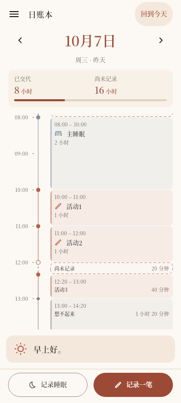
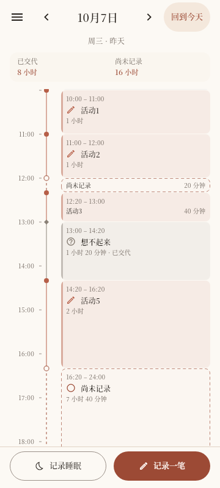

# HOME-TIME-VISUAL-01 · 首页视觉细化

日期：2026-10-09。依据为用户对上一轮首页截图的九点反馈及[局部视觉规格](../../design.md#首页视觉细化2026-10-09用户九点反馈)。本轮仅调整首页presentation；72dp / 小时、短段簇、半开命中、双态滞回、时刻锚点和既有入口继续适用。上一轮[实施报告](HOME_PROPORTIONAL_TIMELINE_REPORT.md)及截图保留为历史证据。

## 调整

上轮截图以2×导出，360dp宽为720px，不能直接把PNG像素当作Flutter sp / dp。本轮普通记录标题16→12sp（2×截图24px），大日期40→28sp，指标数字25→18sp；时间 / 辅助文字分别统一10sp。底部文字15→13sp、图标20→16dp，按钮仍满足48dp标准目标。系统文字缩放正常生效；2×时根据实测宽度优先保留完整按钮文字，容纳不下时省掉装饰图标。

| 用户反馈 | 本轮结果 |
| --- | --- |
| 字号梯度 | 日期 / 统计 / 标题 / 辅助各有层级，样式集中在首页局部`HomeLedgerStyle` |
| 卡片信息过松 | 信息组上下8dp，范围→标题4dp，标题→时长4dp；几何高度仍表示真实时长，长段空白保留 |
| 图标 / 标题基线 | 同一Row垂直居中；16dp图标与标题间8dp |
| 标尺左宽右贴 | 按实际小时字符串测量标签宽度并向4dp取整；文字→刻度8、刻度长4、刻度→轨道8、轨道→卡片24dp；页面边距16dp |
| 节点 / 上沿偏差 | 事实填充上沿和节点中心都取`y(start)`，分隔细缝只内缩底边，不累计外边距 |
| 短状态条挤 | 10sp / 1.2行高独立样式，在真实区间与可见交集内居中；左右8dp |
| 页头节奏 | 展开态回今天置于顶栏；紧凑态按实际宽度并入导航行，窄屏大字 / 跨年允许第二行；副标题前8、后12、状态块至时间轴12dp；视口边缘不画半截小时标签或状态词 |
| 指标松散 | label→数字4dp，数字 / 单位同一RichText基线，比例条前8dp；内部12dp，紧凑8dp |
| 底部过强 | 缩小文字 / 图标，统一8dp内部间隔和12dp按钮间隔；按钮48dp目标，大字可增长 |

短条状态词的有限a11yFactor判定改为测量实际10sp / 1.2样式，避免测量与绘制不一致。320dp / 2×下20分钟为24dp，修订后的状态行24dp可显示，当前矩阵全部保持72。Q-039的有限测量条件与1.25上限仍保留；不会因为首轮曾需要90而继续无条件启用。未增加min-height或限制系统文字缩放。

## 验证

HOME-TIME-VISUAL-01完成。最终命令数组见[commands.json](assets/home-timeline-visual-refinement/commands.json)，均exit0。

| 实际检查 | 结果 / 原始证据 |
| --- | --- |
| `dart format --output=none --set-exit-if-changed`，本轮7个Dart文件 | 7文件0变化；[格式日志](assets/home-timeline-visual-refinement/format.txt) |
| `flutter analyze --no-pub` | No issues found；[分析日志](assets/home-timeline-visual-refinement/analysis.txt) |
| 首页相关10个测试文件 | **64通过**；[测试日志](assets/home-timeline-visual-refinement/tests.txt) |
| `flutter test --no-pub integration_test/home_timeline_platform_test.dart -d emulator-5554 --reporter expanded` | **Android模拟器1个端到端场景通过**；真实引擎 / 独立SQLite，验证短段选择、Unknown、Gap上下文、完整跨日睡眠、两记录入口、菜单与返回位置；[日志](assets/home-timeline-visual-refinement/android.txt) |
| `flutter drive --no-pub -d web-server --browser-name=chrome --chrome-binary=/usr/bin/chromium --driver test_driver/integration_test.dart --target integration_test/home_timeline_platform_test.dart --web-port=8765` | 同一场景在**Chromium Web通过**；[日志](assets/home-timeline-visual-refinement/web.txt) |
| `flutter build apk --debug --no-pub`、`flutter build web --no-pub` | 两平台构建成功；[Android](assets/home-timeline-visual-refinement/build-apk.txt) / [Web](assets/home-timeline-visual-refinement/build-web.txt) |
| `git diff --check`、本地链接 / 问题编号 / 原参考哈希 | 通过；[文档检查](assets/home-timeline-visual-refinement/document-check.json) |

本轮新增实际布局检查：小时刻度中心与一小时块上沿一致、图标 / 标题中心一致、信息组互不重叠、20分钟状态 / 时长居中并在真实24dp内；扩充矩阵检查标准控件≥48×48、四字底部标签保持整行、可见小时标签不被页头 / 页脚截断。保留几何、短段 / 面板、滞回、时间锚点、连续手势、切日失败、跨午夜、刷新 / 返回、resize等原回归。

320dp / 2×实测日志：`p=72, block=24, word=24`；90比例对照为`block=30, word=24`。两者均可显示状态词，因此当前生产矩阵全部72；[72截图](assets/home-timeline-visual-refinement/a11y-72-320-2.png) / [90对照](assets/home-timeline-visual-refinement/a11y-90-320-2.png)。这是修订样式后的证据，首轮“72不可显示”的截图仍保留在原报告中。

HOME-TIME-04仍为PARTIAL：本轮组件视觉与双平台回归不替代人工TalkBack朗读、实机误触或物理设备验收。未跑全量仓库测试；构建输出仍有既有Java native-access及CupertinoIcons字体查找提示，实际构建exit0，未为这些提示增加依赖。

## 两态截图

320 / 360 / 412dp × 1× / 1.5× / 2×文字 × 两态，共18张矩阵截图；另有2张比例对照和2张1×导出，共22张。完整尺寸与导出倍率见[captures.json](assets/home-timeline-visual-refinement/captures.json)。普通截图按2×导出，1×示例直接从Flutter以pixelRatio=1生成。

| 展开，360×800、1×文字 / 1×导出 | 收起，同一夹具 |
| --- | --- |
|  |  |

同一尺寸的[2×导出展开图](assets/home-timeline-visual-refinement/expanded-360.0-1.0.png) / [收起图](assets/home-timeline-visual-refinement/collapsed-360.0-1.0.png)，以及[320dp / 2×文字](assets/home-timeline-visual-refinement/collapsed-320.0-2.0.png)、[412dp / 2×文字](assets/home-timeline-visual-refinement/collapsed-412.0-2.0.png)可放大核对。夹具“8小时 / 16小时”是该日正式事实投影，不按原型总量造数据。

修改范围：`home_ledger_style.dart`、`home_day_axis.dart`、`home_day_header.dart`、`home_coverage_line.dart`、`home_shell.dart`、`home_timeline_tab.dart`及`home_proportional_timeline_test.dart`；另同步本轮设计 / 方案 / 任务 / 台账。没有修改领域、schema、依赖、时间初始化或提醒算法。
